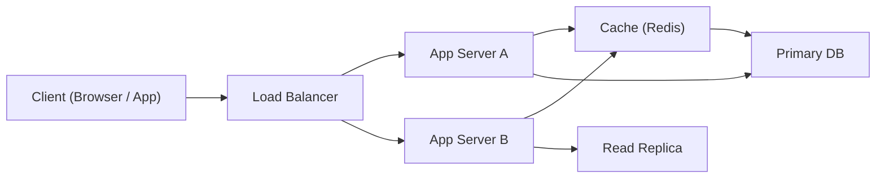

# 시스템 디자인(System Design)이란?

> 출처: https://www.sysdesai.com/learn/foundations/what-is-system-design

---

## 시스템 디자인(System Design)이란?

**시스템 디자인(System Design)**은 요구사항을 충족하기 위해 시스템의 아키텍처(Architecture), 컴포넌트(Component), 인터페이스(Interface), 데이터 흐름(Data Flow)을 정의하는 과정입니다. 이는 개별 알고리즘(Algorithm)이나 자료구조(Data Structure)보다 높은 수준에서 이루어집니다. "이 리스트를 어떻게 정렬할까?"라고 묻는 대신, 시스템 디자인은 "수십억 개의 사용자 레코드를 낮은 지연 시간(Latency)으로 안정적으로 저장하고 조회하는 서비스를 어떻게 구축할까?"를 고민합니다.

실제로 중요도가 있는 모든 소프트웨어 제품은 수많은 시스템 디자인 결정들이 얽힌 결과물입니다. 어떤 데이터베이스(Database)를 사용할지, 서비스(Service) 간에 어떻게 통신할지, 데이터를 어디에 캐시(Cache)할지, 장애를 어떻게 처리할지 등이 포함됩니다. 이러한 결정들을 잘 내리는 엔지니어는 확장(Scale)이 가능하고, 장애(Outage)에도 살아남으며, 우아하게 발전하는 제품을 만듭니다.

## 시스템 디자인 스펙트럼(System Design Spectrum)

시스템 디자인은 광범위한 문제를 다룹니다. 한쪽 끝에는 **저수준 디자인(Low-level Design)**(단일 서비스의 클래스 구조, API 형태, 데이터 모델)이 있고, 다른 쪽 끝에는 **고수준 디자인(High-level Design)**(수백만 명의 사용자를 지원하기 위해 수십 개의 마이크로서비스(Microservices), 데이터베이스, 큐(Queue)가 어떻게 맞물려 돌아가는지)이 있습니다. 인터뷰에서는 보통 이 강의에서 다루는 고수준 디자인에 집중합니다.

*웹 시스템의 단순화된 모습: 클라이언트(Client), 로드 밸런서(Load Balancer), 애플리케이션 서버(App Server), 캐시, 데이터베이스.*

## 인터뷰에서 시스템 디자인이 중요한 이유

시니어(Senior)나 스태프(Staff)급 엔지니어 역할의 경우, 시스템 디자인은 인터뷰에서 가장 중요한 신호입니다. 뛰어난 알고리즘 인터뷰는 구현 능력을 보여주지만, 뛰어난 시스템 디자인 인터뷰는 **설계(Architect)** 능력을 보여줍니다. 구글, 메타, 아마존, 넷플릭스 같은 기업들이 별도의 시스템 디자인 세션을 운영하는 이유이기도 합니다.

시스템을 설계하는 능력은 업무 성과와도 직결됩니다. 분산 시스템(Distributed Systems)의 기초를 이해하는 엔지니어는 데이터베이스 스키마(Schema) 선택부터 API 디자인, 용량 계획(Capacity Planning)에 이르기까지 모든 계층에서 더 나은 결정을 내릴 수 있습니다.

## 인터뷰 평가 방식

회사마다 기준은 다르지만, 대부분의 면접관은 다음 다섯 가지 측면에서 시스템 디자인 능력을 평가합니다.

| 차원 | 면접관이 확인하는 것 |
| --- | --- |
| 문제 범위 확정(Problem Scoping) | 설계를 시작하기 전에 요구사항을 명확히 하나요? 규모, 제약 사항, 비기능적 요구사항을 식별하나요? |
| 고수준 디자인(High-Level Design) | 문제를 일관된 컴포넌트로 분해할 수 있나요? 아키텍처가 논리적이고 완전한가요? |
| 심층 분석(Deep Dives) | 특정 서브시스템(예: 데이터베이스 계층, 캐싱 전략)에 대해 자세히 논리적으로 설명할 수 있나요? |
| 트레이드오프(Trade-Off) 판단 | 대안을 인지하고 왜 한 가지 방식을 선택했는지 설명하나요? |
| 커뮤니케이션(Communication) | 설명이 구조적이고 명확하며 협력적인가요? 힌트를 듣고 유연하게 대처하나요? |

## 모든 인터뷰를 위한 프레임워크

경험 많은 시스템 디자인 면접관들은 구조화된 흐름을 따릅니다. 이 구조를 기억하면 문제를 제대로 이해하지 못한 채 바로 박스를 그리는 흔한 실수를 방지할 수 있습니다.

1. **요구사항 명확화(Clarify requirements)** — 사용자 수, 규모, 일관성 필요성, 읽기/쓰기 비율, 지연 시간 목표 등을 묻습니다.
2. **규모 추정(Estimate scale)** — 대략적인 추정(Back-of-the-envelope): QPS, 저장 용량, 대역폭(Bandwidth) 등을 계산합니다. 이는 모든 아키텍처 결정의 근거가 됩니다.
3. **API 정의(Define the API)** — 시스템이 노출하는 엔드포인트(Endpoint)나 인터페이스는 무엇인가요? 입/출력(Input/Output)은 무엇인가요?
4. **고수준 디자인(High-level design)** — 주요 컴포넌트와 그 사이의 데이터 흐름을 그립니다.
5. **심층 분석(Deep dive)** — 1~2개의 핵심 서브시스템을 골라 깊게 파고듭니다: 데이터베이스 스키마, 캐싱 전략, 장애 처리 등.
6. **병목 현상(Bottleneck) 식별** — 부하가 집중되는 곳(Hotspot)은 어디인가요? 어떻게 확장(Scale)하거나 회복 탄력성(Resilient)을 높일 수 있을까요?
7. **마무리(Wrap up)** — 트레이드오프를 요약하고, 시간이 더 있다면 다르게 했을 부분을 논의합니다.

> 💡
> 인터뷰 팁
> 화이트보드(Whiteboard)에 손을 대기 전에 항상 3~5개의 범위 확정 질문을 던지세요. 이는 시니어다운 면모를 보여주며, 헛수고를 방지하고 생각할 시간을 벌어줍니다. 좋은 질문의 예: "일일 활성 사용자 수(DAU)는 얼마나 되나요?", "지연 시간 요구사항은 무엇인가요?", "읽기 혹은 쓰기 처리량(Throughput) 중 어디에 최적화해야 하나요?", "지리적 분산(Geographic Distribution) 요구사항이 있나요?"

## 피해야 할 흔한 실수들

- **성급한 솔루션 제시** — 요구사항을 이해하기도 전에 데이터베이스나 프레임워크를 선택하는 것.
- **섣부른 최적화(Premature optimization)** — 기본 부하를 확인하기도 전에 샤딩(Sharding)이나 글로벌 복제(Replication)를 도입하는 것.
- **실패 모드(Failure Mode) 무시** — 컴포넌트가 실패했을 때의 대책 없이 정상적인 상황(Happy path)만 설계하는 것.
- **침묵** — 설명 없이 생각만 하는 것. 면접관은 들리는 내용으로만 평가할 수 있습니다.
- **트레이드오프 부재** — 자신의 디자인을 유일한 정답인 것처럼 제시하는 것. 모든 디자인에는 단점이 있습니다.
- **데이터 모델(Data Model) 누락** — 데이터가 실제로 어떻게 저장되고 조회되는지 고민하는 것을 잊는 것.

> 💡
> 소리 내어 생각하기
> 면접관은 당신을 평가하는 판사가 아니라 협력자입니다. 작업하면서 논리적 근거를 말로 설명하세요. "간단한 방식부터 시작해서 병목 현상을 찾아보겠습니다"라거나 "데이터가 관계형(Relational)이고 일관성(Consistency)이 중요하므로 PostgreSQL을 선택하겠습니다. 하지만 쓰기 부하를 크게 확장해야 한다면 다시 고려해볼 수 있습니다"라고 말해보세요. 이런 협력적인 스타일이 시니어 엔지니어가 실제로 일하는 방식입니다.

## 토대 다지기

이 모듈의 나머지 레슨에서는 거의 모든 시스템 디자인 인터뷰에서 등장하는 핵심 개념들을 다룹니다: 확장 전략(Scalability), 신뢰성 및 가용성(Reliability & Availability), CAP 정리(CAP Theorem), 일관성 모델(Consistency Models), SLA/SLO/SLI, 그리고 추정(Estimation)입니다. 이 개념들을 익히면 어떤 시스템 디자인 문제라도 풀 수 있는 어휘와 사고의 틀을 갖추게 될 것입니다.

> ℹ️
> 정답은 하나가 아닙니다
> 모든 시스템 디자인 질문에는 여러 가지 유효한 해결책이 있습니다. 넷플릭스와 유튜브는 둘 다 대규모로 비디오를 서비스하지만 아키텍처는 매우 다릅니다. 목표는 특정 회사의 아키텍처를 그대로 재현하는 것이 아니라, 제약 사항을 논리적으로 분석하고 원칙에 기반한 결정을 내릴 수 있음을 보여주는 것입니다.
