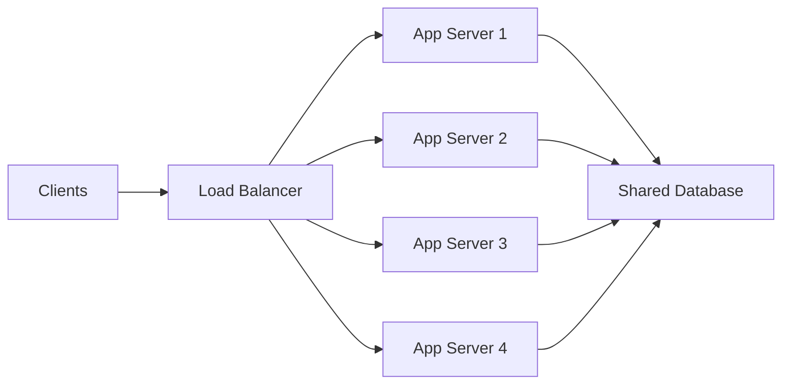

# 확장성(Scalability): 수직적 확장 vs 수평적 확장

> 출처: https://www.sysdesai.com/learn/foundations/scalability

---

## 핵심 확장 과제

성공적인 모든 시스템은 결국 성장의 문제에 직면합니다. 처음 설계했던 부하(Load)가 더 이상 충분하지 않게 되는 시점이 오기 때문입니다. 사용자가 늘어나고 데이터가 쌓이며 최대 트래픽(Peak Traffic)이 급증합니다. **확장성(Scalability)**은 리소스(Resource)를 추가하여 늘어나는 부하를 처리할 수 있는 시스템의 특성을 말합니다. 여기에는 수직적 확장과 수평적 확장이라는 두 가지 근본적인 전략이 있으며, 각각 완전히 다른 철학과 트레이드오프(Trade-off)를 가지고 있습니다.

## 수직적 확장 (Vertical Scaling / Scale Up)

**수직적 확장(Vertical Scaling)**은 단일 서버의 성능을 높이는 것을 의미합니다: 더 많은 CPU 코어(CPU Core), 더 많은 RAM, 더 빠른 디스크(Disk), 더 높은 네트워크 대역폭(Network Bandwidth)을 추가하는 식입니다. 애플리케이션 코드를 수정할 필요가 없으므로 가장 단순한 확장 전략입니다. 하드웨어(Hardware)를 업그레이드하고 재시작하기만 하면 됩니다.

초기 단계의 제품은 거의 항상 여기서 시작합니다. 인스타그램이 처음 출시되었을 때나 트위터가 작은 스타트업이었을 때도 전체 스택(Stack)을 몇 대의 서버에서 운영했습니다. 수직적 확장은 최소한의 엔지니어링 리소스로 빠른 효과를 제공합니다.

📌
실제 사례: Amazon RDS

Amazon RDS를 사용하면 API 호출 한 번으로 데이터베이스를 수직적으로 확장할 수 있습니다. `db.t3.micro`(2 vCPU, 1 GB RAM)에서 `db.r6g.16xlarge`(64 vCPU, 512 GB RAM)로 업그레이드할 수 있습니다. 짧은 재시작 시간이 필요하지만 애플리케이션을 수정할 필요는 없습니다. 많은 운영 시스템이 읽기 복제본(Read Replica)이나 샤딩(Sharding)을 고려하기 훨씬 전부터 RDS 수직적 확장에 의존합니다.

### 수직적 확장의 한계

- **물리적 천장** — 구매할 수 있는 서버 크기에는 한계가 있습니다. AWS에서 가장 큰 EC2 인스턴스(u-24tb1.112xlarge)는 448 vCPU와 24 TB RAM을 갖추고 있습니다. 그 이상의 확장은 불가능합니다.
- **비용 곡선** — 용량을 두 배로 늘린다고 비용이 두 배가 되지는 않습니다. 고성능 서버의 가격은 성능 향상 폭보다 훨씬 가파르게 상승합니다.
- **단일 장애점(Single Point of Failure)** — 서버가 한 대뿐이라면 장애 도메인(Failure Domain)도 하나입니다. 서버가 죽으면 시스템 전체가 중단됩니다.
- **업그레이드를 위한 다운타임(Downtime)** — 더 큰 인스턴스로 옮기려면 보통 재시작을 위한 시간이 필요합니다.

## 수평적 확장 (Horizontal Scaling / Scale Out)

**수평적 확장(Horizontal Scaling)**은 한 대의 서버를 키우는 대신 서버 플릿(Fleet)에 더 많은 장비를 추가하는 것을 의미합니다. 로드 밸런서(Load Balancer)가 들어오는 요청을 여러 애플리케이션 서버로 분산합니다. 부하가 늘어나면 서버를 추가하고, 줄어들면 제거합니다. 클라우드 제공업체(Cloud Provider)는 이를 **탄력적 확장(Elastic Scaling)**이라고 부릅니다.

*수평적 확장: 로드 밸런서가 트래픽을 동일한 여러 애플리케이션 서버로 분산합니다.*

수평적 확장은 세계 최대 규모의 시스템들이 작동하는 방식입니다. 구글, 넷플릭스, 우버는 수천 대에서 수십만 대의 범용 서버 플릿에서 실행됩니다. 이 플릿에 속한 개별 서버는 특별할 것이 없지만, 이들이 함께 협력할 때 강력한 힘이 나옵니다.

### 무상태(Stateless) 요구사항

수평적 확장을 위한 가장 중요한 아키텍처적 전제 조건은 **무상태성(Statelessness)**입니다. 애플리케이션이 세션 데이터(Session Data)(사용자 로그인 상태, 장바구니 내용 등)를 로컬 메모리(Memory)에 저장한다면, 해당 사용자의 다음 요청도 반드시 같은 서버로 전달되어야 합니다. 이를 **스티키 세션(Sticky Sessions)**이라고 하며, 이는 로드 밸런싱의 목적을 무색하게 만듭니다.

해결책은 모든 상태를 외부화(Externalize)하는 것입니다: 세션은 **Redis**에, 파일은 **S3나 CDN**에, 구조화된 데이터는 **데이터베이스(Database)**에 저장합니다. 이렇게 하면 애플리케이션 서버들은 서로 대체 가능한 상태가 되며, 어떤 서버라도 모든 요청을 처리할 수 있습니다. 이것이 바로 오토 스케일링 그룹(Auto-scaling Group)과 롤링 배포(Rolling Deployment)를 가능하게 만드는 핵심입니다.

## 비교 요약

| 차원 | 수직적 확장 | 수평적 확장 |
| --- | --- | --- |
| 메커니즘 | 더 큰 사양의 장비로 업그레이드 | 플릿에 장비 추가 |
| 애플리케이션 변경 | 필요 없음 | 무상태(Stateless)여야 함; 조정 로직이 필요할 수 있음 |
| 비용 모델 | 고사양일수록 기하급수적으로 증가 | 선형적 증가; 범용 하드웨어(Commodity Hardware) 사용 |
| 확장 한계 | 물리적 천장이 존재함 | 사실상 무제한(클라우드 기준) |
| 장애 도메인 | 단일 장애점(Single Point of Failure) | 개별 서버 장애는 큰 영향이 없음 |
| 복잡도 | 낮음 (운영 차원) | 높음 (로드 밸런싱, 분산 상태 관리, 서비스 디스커버리 등) |
| 적합한 분야 | 데이터베이스, 초기 단계 제품 | 애플리케이션 서버, 웹 서비스, 마이크로서비스(Microservices) |
| 예시 | PostgreSQL을 더 큰 RDS 인스턴스로 업그레이드 | AWS상의 넷플릭스 오토 스케일링 API 플릿 |

## 데이터베이스 확장 전략

데이터베이스는 상태를 유지해야 하므로 수평적으로 확장하기 가장 어려운 컴포넌트입니다. 주요 전략은 다음과 같습니다:

- **읽기 복제본(Read Replicas)** — 데이터를 읽기 전용 팔로워(Follower)들에 복제합니다. 읽기 요청은 여러 복제본으로 분산되고, 쓰기 요청은 프라이머리(Primary) DB로만 전달됩니다. 대부분의 시스템처럼 읽기 비중이 높은 경우에 효과적입니다.
- **캐싱(Caching)** — 데이터베이스 앞에 캐시(Redis, Memcached)를 둡니다. 자주 읽히는 데이터를 메모리에서 제공하여 데이터베이스 부하를 90% 이상 줄일 수 있는 경우가 많습니다.
- **샤딩(Sharding)** — 데이터를 샤드 키(Shard Key)(예: 사용자 ID)를 기준으로 여러 데이터베이스 인스턴스(샤드)로 분할합니다. 각 샤드는 특정 범위의 데이터를 소유합니다. 읽기와 쓰기 모두를 크게 확장할 수 있지만, 크로스 샤드 쿼리, 리밸런싱(Rebalancing), 핫 샤드(Hot-shard) 문제 등의 복잡성이 추가됩니다.
- **CQRS** — 명령 및 조회 책임 분리(Command Query Responsibility Segregation): 쓰기 모델과 읽기 모델을 완전히 분리하여 각각을 독립적으로 최적화하고 확장할 수 있게 합니다.

> 💡
> 인터뷰 팁
> 면접관이 시스템을 어떻게 확장할지 물으면 가장 단순한 접근법부터 시작하세요: 데이터베이스는 수직적 확장, 무상태 애플리케이션 서버는 로드 밸런서 뒤에서 수평적 확장, 그리고 데이터베이스 읽기 부하를 줄이기 위한 캐시 계층(Redis)을 도입합니다. 단일 프라이머리 데이터베이스가 쓰기 처리량(Write Throughput)을 감당할 수 없다는 것을 추정치로 증명할 수 있을 때만 샤딩을 언급하세요. 섣부른 샤딩은 엄청난 복잡성을 초래하며 부정적인 신호가 될 수 있습니다.

## 탄력적 오토 스케일링(Elastic Auto-Scaling)

현대적인 클라우드 플랫폼은 수평적 확장을 자동으로 수행합니다. AWS Auto Scaling Groups, Google Cloud Managed Instance Groups, Kubernetes Horizontal Pod Autoscaler 등은 메트릭(Metric)(CPU, 메모리, 요청 큐 깊이(Request Queue Depth) 등)을 모니터링하여 인스턴스를 자동으로 추가하거나 제거합니다.

**넷플릭스(Netflix)**는 AWS에서 대규모 탄력적 인프라를 구축한 선구자입니다. 피크 시간대인 저녁에는 API 플릿이 평소보다 10배 더 확장되어 트래픽을 처리하고, 밤에는 다시 줄여서 사용한 만큼만 비용을 지불합니다. 이는 서비스들이 무상태(Stateless)이고 수평적으로 확장 가능하기 때문에 가능합니다.

> ⚠️
> 데이터베이스 확장은 자동이 아닙니다
> 오토 스케일링은 무상태 컴퓨트(Compute) 환경에서 잘 작동합니다. 데이터베이스는 다릅니다: 데이터 마이그레이션 없이 자동으로 새로운 샤드를 추가할 수는 없습니다. 따라서 데이터 계층은 신중하게 계획해야 합니다. 잘못 선택한 데이터 모델이나 데이터베이스 기술은 출시 후 변경하는 데 큰 비용이 듭니다.

## 어떤 방식을 선택해야 할까?

실용적인 원칙은 다음과 같습니다: **한계에 부딪힐 때까지 수직적으로 확장하고, 그 후에 수평적으로 확장하세요.** 대부분의 제품에서 첫 번째 확장 조치는 샤딩이 아니라 캐시 계층과 읽기 복제본을 추가하는 것입니다. 샤딩된 데이터베이스의 운영 복잡성은 단일 대형 데이터베이스로 부하를 정말 감당할 수 없을 때만 정당화됩니다.

이 패턴을 연습해 보세요
[100명에서 1,000만 명의 사용자로 확장해야 하는 웹 애플리케이션 설계하기](https://www.sysdesai.com/design/new?prompt=Design%20a%20web%20application%20that%20needs%20to%20scale%20from%20100%20to%2010%20million%20users&mode=fast)
