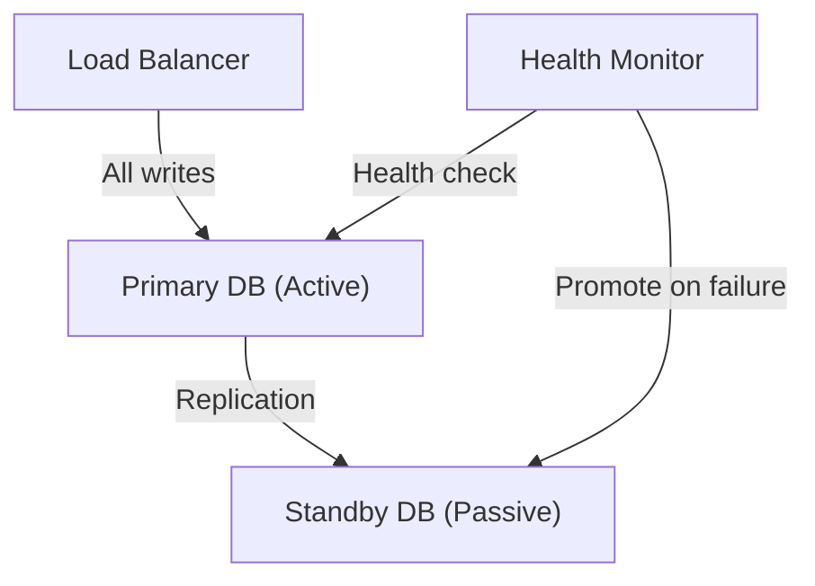

# 신뢰성, 가용성 및 결함 허용(Reliability, Availability & Fault Tolerance)

> 출처: https://www.sysdesai.com/learn/foundations/reliability-availability

---

## 신뢰성(Reliability) vs 가용성(Availability)

일상적인 대화에서는 이 용어들을 혼용해서 쓰기도 하지만, 인터뷰에서는 이 둘의 차이를 정확히 구분하는 것이 중요합니다.

| 속성 | 정의 | 예시 |
| --- | --- | --- |
| 가용성(Availability) | 시스템이 정상적으로 작동하며 응답 가능한 시간의 비율 | 99.9% 가동 시간 = 연간 8.7시간의 다운타임(Downtime) |
| 신뢰성(Reliability) | 일정 기간 동안 시스템이 의도된 기능을 정확하게 수행할 확률 | 요청의 99.9%가 정확한 결과를 반환함 |
| 결함 허용(Fault Tolerance) | 컴포넌트 장애가 발생해도 시스템이 정상적으로 계속 작동할 수 있는 능력 | 노드(Node) 하나가 다운되어도 사용자는 서비스 중단을 느끼지 못함 |
| 내구성(Durability) | 커밋된 데이터(Committed Data)가 손실되지 않는다는 보장 | S3의 99.999999999%(11 nines) 데이터 보관 내구성 |

> ℹ️
> 내구성은 가용성이 아닙니다
> S3는 11 nines의 내구성으로 유명합니다. 즉, 데이터가 손실될 확률이 극히 낮습니다. 하지만 S3도 장애로 인해 가용성이 떨어져(요청에 응답하지 못함) 서비스를 이용할 수 없는 경우가 있었습니다. 이때 데이터는 여전히 내구성을 유지(파괴되지 않음)하고 있었습니다. 이 두 가지는 서로 독립적인 보장 범위입니다.

## 가용성의 등급 (The Nines of Availability)

가용성은 보통 업타임(Uptime)의 백분율로 표시됩니다. 업계에서는 이 백분율에 포함된 '9'의 개수로 등급을 표현하곤 합니다.

| 등급 | 가용성 | 연간 다운타임 | 월간 다운타임 | 주요 사례 |
| --- | --- | --- | --- | --- |
| Two nines (99%) | 99% | 3.65일 | 7.3시간 | 내부 도구, 배치 시스템 |
| Three nines (99.9%) | 99.9% | 8.76시간 | 43.8분 | 표준 웹 서비스 |
| Four nines (99.99%) | 99.99% | 52.6분 | 4.4분 | 비즈니스 크리티컬 시스템 |
| Five nines (99.999%) | 99.999% | 5.3분 | 26.3초 | 통신망, 결제 시스템 |

가용성에 '9'를 하나씩 추가할 때마다 구현 난이도와 비용은 약 10배씩 증가합니다. 99.9%에서 99.99%로 가는 것은 단순한 개선이 아니라, 모든 계층의 중복성(Redundancy), 자동 장애 조치(Failover), 매우 엄격한 운영 프로세스 등 근본적인 아키텍처 변화가 필요합니다.

## 의존성이 가용성을 낮추는 이유

요청이 여러 서비스를 순차적으로(직렬로) 거쳐야 하는 경우, 전체 가용성은 각 컴포넌트 가용성의 **곱**이 됩니다.

```
# 직렬 컴포넌트의 시스템 가용성:
전체 가용성 = A1 × A2 × A3 × ...

# 예시: 각각 99.9% 가용성을 가진 3개의 서비스
전체 가용성 = 0.999 × 0.999 × 0.999 = 0.997 = 99.7%

# 대규모 마이크로서비스: 각각 99.9%인 10개의 서비스
전체 가용성 = 0.999^10 = 0.990 = 99.0%  ← 소수점 이하 9가 두 개뿐!

# 병렬(중복) 컴포넌트의 경우:
전체 가용성 = 1 - (1-A)^N
# 각각 99% 가용성을 가진 2개의 서비스를 병렬로 운영할 때:
전체 가용성 = 1 - (0.01 × 0.01) = 1 - 0.0001 = 99.99%  ← 9가 네 개로 증가!
```

이 수학적 사실은 시사하는 바가 큽니다. 임계 경로(Critical Path)에 99.9% 가용성을 가진 서비스 50개가 있다면 전체 가용성은 95.1%로 떨어집니다. 이것이 고가용성 시스템이 중복성(병렬 경로)을 갖도록 설계되는 이유이며, 동기적 의존성(Synchronous Dependency)을 최소화하는 것이 중요한 이유입니다.

## 결함 허용(Fault Tolerance) 패턴

결함 허용은 여러 아키텍처 패턴의 조합을 통해 달성됩니다. 이러한 패턴을 이해하고 적재적소에 적용하는 능력이 시스템 디자인 인터뷰의 핵심입니다.

### 중복성 및 복제 (Redundancy and Replication)

가장 기본적인 결함 허용 기술은 컴포넌트의 복사본을 여러 개 실행하여 하나가 실패하면 다른 것이 업무를 이어받게 하는 것입니다. 이는 **액티브-패시브(Active-passive)**(한 리더가 트래픽을 처리하고 장애 시 복제본이 이어받음) 또는 **액티브-액티브(Active-active)**(여러 노드가 동시에 트래픽을 처리하며 일부가 실패해도 영향이 없음) 방식으로 구현할 수 있습니다.


*액티브-패시브 장애 조치(Failover): 프라이머리가 모든 트래픽을 처리하며, 프라이머리 장애 시 스탠바이가 업무를 이어받습니다.*

### 서킷 브레이커 (Circuit Breaker)

전기 차단기에서 이름을 딴 **서킷 브레이커(Circuit Breaker)**는 의존성 호출을 모니터링합니다. 실패율이 임계값(Threshold)을 넘으면 회로를 '개방(Open)'하여, 이후의 호출은 다운스트림 서비스(Downstream Service)를 호출하지 않고 즉시 실패 처리합니다. 일정 시간이 지나면 '반개방(Half-open)' 상태가 되어 프로브 요청(Probe Request)을 보냅니다. 성공하면 회로를 '폐쇄(Close)'하고 정상 운영을 재개합니다.

넷플릭스의 **Hystrix** 라이브러리가 마이크로서비스에서 서킷 브레이커를 대중화했습니다. 넷플릭스의 추천 서비스에 장애가 발생하면 서킷 브레이커는 스트리밍 요청이 타임아웃(Timeout)을 기다리지 않고 즉시 실패하게 하여, 스레드(Thread) 자원을 보존하고 핵심인 영상 재생 경험을 유지할 수 있게 합니다.

### 벌크헤드 격리 (Bulkhead Isolation)

선박 설계(선체가 파손되어도 배 전체가 가라앉지 않게 칸막이를 나누는 구조)에서 빌려온 **벌크헤드 패턴(Bulkhead Pattern)**은 리소스를 분할하여 장애를 격리합니다. 서로 다른 서비스나 테넌트(Tenant)에게 별도의 스레드 풀(Thread Pool), 커넥션 풀(Connection Pool) 또는 별도의 인프라를 할당합니다. 한 영역의 부하 급증이 다른 영역에 필요한 리소스를 고갈시키지 않도록 합니다.

### 타임아웃과 재시도 (Timeouts and Retries)

- **타임아웃(Timeouts)** — 모든 네트워크 호출에는 타임아웃이 있어야 합니다. 타임아웃이 없는 느린 의존성은 스레드를 무한정 점유하여 시스템 전체의 연쇄 장애를 일으킬 수 있습니다.
- **지수 백오프를 이용한 재시도(Retry with exponential backoff)** — 일시적 장애(Transient Failure) 발생 시 짧은 대기 후 재시도합니다. 재시도할 때마다 대기 시간을 두 배로 늘립니다(백오프). 모든 클라이언트가 동시에 재시도하여 서버를 마비시키는 현상(Thundering Herd)을 방지하기 위해 무작위성인 **지터(Jitter)**를 추가합니다.
- **멱등성(Idempotency)** — 재시도는 작업이 멱등할 때만 안전합니다(여러 번 호출해도 결과가 같음). 결제 시스템에서는 중복 결제를 방지하기 위해 멱등성 키(Idempotency Key)를 사용하는 등 특히 주의해야 합니다.

## 실패를 대비한 설계

가장 회복 탄력적인 시스템은 모든 컴포넌트가 언젠가 **실패할 것**이라고 가정하고, 기능이 단계적으로 저하(Graceful Degradation)되도록 설계합니다. 아마존의 **카오스 엔지니어링(Chaos Engineering)**은 운영 환경에 의도적으로 장애를 주입하여 시스템이 이를 잘 처리하는지 검증하는 기법입니다. 넷플릭스의 **Chaos Monkey**는 업무 시간에 무작위로 EC2 인스턴스를 종료하여 서비스들이 단일 노드에 의존하지 않도록 강제합니다.

> ⚠️
> 상관관계가 있는 장애(Correlated failures)가 진짜 위험입니다
> 중복성은 독립적인 장애로부터 시스템을 보호합니다. 하지만 동일한 버그, 동일한 정전, 동일한 트래픽 급증으로 인해 모든 복제본이 동시에 죽는 상관관계 장애는 매우 위험합니다. 이것이 바로 고가용성 시스템이 여러 **가용 영역(Availability Zone, AZ)**에 분산되어야 하며, 매우 중요한 작업의 경우 여러 **지리적 리전(Geographic Region)**에 걸쳐 운영되어야 하는 이유입니다.

> 💡
> 인터뷰 팁
> 인터뷰에서 결함 허용 시스템을 설계할 때는 여러 계층에서 장애를 다루세요: "애플리케이션 서버는 헬스 체크 기능이 있는 로드 밸런서 뒤에 여러 인스턴스로 둡니다. 데이터베이스는 두 번째 AZ의 스탠바이로 동기 복제를 수행하며 자동 장애 조치를 지원합니다. 추천 서비스 장애가 결제에 영향을 주지 않도록 서킷 브레이커로 격리합니다. 재시도는 멱등성을 보장하며 지수 백오프와 지터를 사용합니다." 이런 계층적 접근 방식은 노련함을 보여줍니다.
