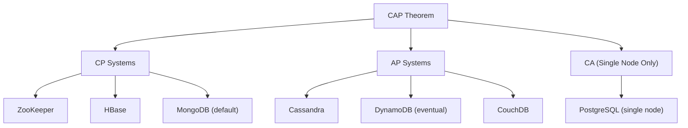

# CAP 정리와 PACELC (CAP Theorem & PACELC)

> 출처: https://www.sysdesai.com/learn/foundations/cap-theorem

---

## CAP 정리(CAP Theorem)

2000년 에릭 브루어(Eric Brewer)가 제안하고 2002년 길버트(Gilbert)와 린치(Lynch)가 공식적으로 증명한 **CAP 정리**는 분산 데이터 저장소(Distributed Data Store)가 다음 세 가지 보장 중 동시에 최대 **두 가지**만 제공할 수 있다는 이론입니다.

- **일관성 (Consistency, C)** — 모든 읽기 작업은 가장 최근의 쓰기 결과 또는 에러를 반환받습니다. 모든 노드(Node)가 동시에 같은 데이터를 봅니다.
- **가용성 (Availability, A)** — 모든 요청은 (가장 최근 데이터라는 보장은 없지만) 에러가 아닌 응답을 받습니다.
- **파티션 허용 (Partition Tolerance, P)** — 노드 간 네트워크 메시지 유실이나 지연이 발생(네트워크 파티션)하더라도 시스템은 계속 작동합니다.

실제 환경에서 **파티션 허용(P)은 타협의 대상이 아닙니다.** 케이블 장애, 스위치 오작동, 데이터 센터(Data Center) 간 연결 유실 등 네트워크 파티션은 언제든 발생할 수 있기 때문입니다. 파티션 상황에서 작동을 멈추는 분산 시스템은 무용지물입니다. 따라서 분산 시스템 설계의 실질적인 선택은 파티션 발생 시 **일관성(C)과 가용성(A)** 중 무엇을 우선할 것인가로 귀결됩니다.

*CAP 정리: 실세계의 분산 시스템은 CP와 AP 중 하나를 선택합니다. CA는 단일 노드 시스템에만 해당됩니다.*

## CP 시스템: 가용성보다 일관성 중시

**CP 시스템**은 네트워크 파티션 발생 시 가용성을 포기합니다. 노드 간의 데이터 동기화가 불가능해지면, 오래된 데이터(Stale Data)를 반환할 위험을 감수하는 대신 요청을 거부(에러 반환)합니다. 이는 금융 원장, 재고 관리, 분산 락 매니저(Distributed Lock Manager) 등 데이터의 정확성이 절대적으로 중요한 애플리케이션에 적합합니다.

**ZooKeeper**는 대표적인 CP 시스템입니다. ZAB(ZooKeeper Atomic Broadcast) 합의 프로토콜(Consensus Protocol)을 사용하여 모든 읽기 작업이 최신 커밋 결과를 반영하도록 보장합니다. 소수의 노드가 격리되는 파티션이 발생하면, 해당 노드들은 읽기와 쓰기 서비스를 중단합니다. 이 때문에 ZooKeeper는 리더 선출(Leader Election)이나 분산 설정(Distributed Configuration) 관리에는 적합하지만, 항상 응답해야 하는 사용자 서비스용으로는 부적합할 수 있습니다.

## AP 시스템: 일관성보다 가용성 중시

**AP 시스템**은 네트워크 파티션 중에도 서비스를 계속 제공하지만, 노드가 오래된 데이터를 반환할 수 있습니다. 파티션의 양쪽 노드에서 모두 쓰기 작업을 수용하고, 나중에 파티션이 복구되면 충돌을 해결(Reconcile)합니다. 이는 소셜 피드, 제품 카탈로그, 사용자 설정 등 완벽한 일관성보다 서비스 가용성이 더 중요한 애플리케이션에 적합합니다.

**Apache Cassandra**는 대표적인 AP 시스템입니다. 파티션 상황에서도 각 구역의 노드들은 계속해서 쓰기 요청을 받습니다. 파티션이 해결되면 Cassandra는 타임스탬프(Timestamp) 기반의 **최종 쓰기 승리(Last-write-wins)** 전략으로 충돌을 해결합니다. 아마존의 **DynamoDB**도 같은 철학을 따릅니다. 기본적으로 최종 일관성(Eventual Consistency)을 제공하며, 엄격한 정확성 대신 높은 가용성과 낮은 지연 시간(Latency)을 택합니다.

## 실전 CAP 분석

| 유스케이스 | CAP 선택 | 이유 |
| --- | --- | --- |
| 은행 계좌 잔고 | CP | 일시적 서비스 중단보다 잘못된 잔고 표시가 더 치명적임 |
| 소셜 미디어 좋아요 수 | AP | 약간의 데이터 차이는 괜찮지만 요청 거부는 곤란함 |
| 장바구니 내용 | AP | 결제 실패보다는 약간 이전의 장바구니를 보여주는 것이 나음 |
| 재고 예약 | CP | 초과 판매는 비즈니스 문제로 직결되므로 조율이 필수적임 |
| 사용자 프로필 설정 | AP | 어제의 설정값이 보여도 수용 가능함 |
| 분산 락 / 리더 선출 | CP | 두 명의 리더가 생기는 것은 재앙이므로 가용성을 포기함 |

> 💡
> 인터뷰 팁
> 인터뷰에서 CAP를 논할 때 이론에만 매몰되지 마세요. 실무적인 관점에서 설명하는 것이 좋습니다: "[비즈니스 이유] 때문에 [기능]에서는 가용성보다 정확성이 중요하므로 [X]와 같은 CP 데이터베이스를 사용하겠습니다. 반면 [다른 기능]은 가용성이 더 중요하므로 [Y]와 같은 AP 저장소를 사용하고 최종 일관성을 고려하여 설계하겠습니다."

## PACELC 확장 모델

CAP 정리의 한계는 네트워크 파티션이라는 상대적으로 드문 상황에서의 동작만 설명한다는 점입니다. 2010년 다니엘 아바디(Daniel Abadi)가 제안한 **PACELC** 모델은 정상 운영 시의 동작까지 포함하도록 CAP를 확장했습니다.

> ℹ️
> PACELC 공식
> 만약 파티션(P)이 발생하면 가용성(A)과 일관성(C) 중 무엇을 택할 것인가? 그 외(E, Else)의 정상 상황에서는 지연 시간(L, Latency)과 일관성(C) 중 무엇을 택할 것인가?

이 모델의 핵심 통찰은 파티션이 없더라도 **복제(Replication) 과정에서 지연 시간과 일관성 사이의 트레이드오프가 발생**한다는 점입니다. 강력한 일관성(Strong Consistency)을 얻으려면 쓰기 작업 시 여러 복제본의 확인을 받아야 하므로 시간이 더 걸립니다. 반면 낮은 지연 시간을 원한다면 하나의 복제본에만 쓰고 즉시 응답할 수 있지만, 이후 읽기에서 오래된 데이터를 볼 위험이 있습니다.

| 시스템 | 파티션 시 동작 | 정상 시 동작 | PACELC 분류 |
| --- | --- | --- | --- |
| Cassandra | 가용성(A) 선호 | 지연 시간(L) 선호 | PA/EL |
| CockroachDB | 일관성(C) 선호 | 일관성(C) 선호 | PC/EC |
| DynamoDB | 가용성(A) 선호 | 지연 시간(L) 선호 (기본값) | PA/EL |
| Spanner | 일관성(C) 선호 | 일관성(C) 선호 | PC/EC |
| MongoDB (기본값) | 일관성(C) 선호 | 일관성(C) 선호 | PC/EC |

## Google Spanner: CAP를 극복했나?

**Google Spanner**는 전 세계에 분산되어 있으면서도 높은 가용성과 외부 일관성을 모두 갖춘 '사실상의 CA' 시스템으로 불리기도 합니다. 이는 CAP 정리를 위반하는 것처럼 보일 수 있습니다. 비밀은 Spanner의 **TrueTime** 기술에 있습니다. 모든 데이터 센터에 GPS와 원자 시계(Atomic Clock)를 두어 트랜잭션(Transaction) 타임스탬프의 오차 범위를 극히 좁혔습니다(±7ms). 이 오차 시간만큼 기다린 후 커밋함으로써 전 세계적으로 일관성을 유지합니다. 물론 지연 시간(TrueTime 대기 시간)이라는 비용을 지불하므로, PACELC 모델 관점에서는 PC/EC(파티션 시 일관성 선택, 정상 시 일관성 선택) 시스템에 해당합니다.

> 💡
> 실세계의 CAP
> 현대의 대부분의 데이터베이스는 이 트레이드오프를 사용자가 조절할 수 있게 해줍니다. Cassandra의 일관성 수준(Consistency Levels: ONE, QUORUM, ALL) 설정을 통해 쿼리별로 더 높은 일관성이나 더 낮은 지연 시간을 선택할 수 있습니다. DynamoDB도 추가 비용을 내고 강력한 일관성 읽기를 선택할 수 있는 옵션을 제공합니다. CP/AP의 이분법적 분류는 단순화된 모델이며, 실제 시스템은 그 사이의 스펙트럼 위에서 작동합니다.
