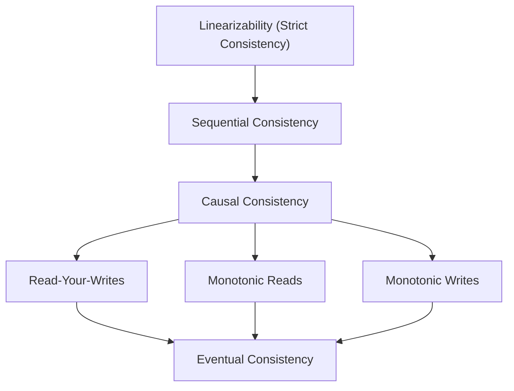

# 일관성 모델 (Consistency Models)

> 출처: https://www.sysdesai.com/learn/foundations/consistency-models

---

## 일관성 모델이란 무엇인가?

**일관성 모델(Consistency Model)**은 분산 시스템(Distributed System)과 클라이언트(Client) 사이의 약속입니다. 이는 이전의 쓰기 작업(Write Operation) 이력이 있을 때 읽기 작업(Read Operation)이 어떤 값을 반환할 수 있는지를 정의합니다. 적절한 일관성 모델을 선택하는 것은 분산 시스템 설계에서 가장 중요한 결정 중 하나입니다. 이는 시스템의 정확성 보장, 성능, 그리고 가용성(Availability)을 결정짓기 때문입니다.

일관성 모델은 가장 강력한 모델부터 가장 약한 모델까지 계층 구조를 이룹니다. 강력한 모델일수록 논리적으로 이해하기 쉽지만 지연 시간(Latency)과 가용성 측면에서 비용이 많이 듭니다. 약한 모델은 더 빠르고 가용성이 높지만 애플리케이션 코드에서 데이터 불일치를 처리해야 합니다.

*일관성 모델 계층 구조: 가장 강력한 모델(위)부터 가장 약한 모델(아래). 상위 모델은 하위 모델의 특성을 포함합니다.*

## 선형성 (Linearizability / Strict Consistency)

**선형성(Linearizability)**은 일관성의 최고 표준입니다. 모든 작업이 실시간상에서 특정 시점에 원자적(Atomic)으로 실행되는 것처럼 보입니다. 클라이언트 입장에서 분산 시스템은 마치 단일 장비처럼 작동합니다. 읽기 작업은 항상 가장 최근에 쓰인 값을 반환하며, 모든 작업은 즉각적으로 처리되는 것처럼 보입니다.

**Google Spanner**는 TrueTime 기술을 사용하여 전 지구적 규모에서 선형성을 달성합니다. 쿠버네티스(Kubernetes)에서 클러스터 상태(Cluster State)를 관리하는 **etcd**도 선형성을 보장합니다. 포드 설정(Pod Configuration)을 쓰면 클러스터 내의 모든 후속 읽기 작업에 그 내용이 즉시 반영됩니다. 이는 오래된 데이터(Stale Data)가 심각한 문제를 일으킬 수 있는 컨트롤 플레인(Control Plane)에서 필수적입니다.

> ⚠️
> 선형성에는 성능 비용이 따릅니다
> 복제된 시스템(Replicated System)에서 선형성을 달성하려면 각 읽기나 쓰기 작업 전에 Raft나 Paxos 같은 합의 프로토콜(Consensus Protocol)을 통한 조율이 필요하며, 이는 지연 시간을 증가시킵니다. Spanner 같은 시스템은 한 리전 내에서는 쓰기에 약 10ms가 걸리지만, 대륙 간에는 최대 100ms까지 걸릴 수 있습니다. 고처리량(High-throughput)이나 지연 시간에 민감한 애플리케이션에는 부담이 될 수 있습니다.

## 순차적 일관성 (Sequential Consistency)

**순차적 일관성(Sequential Consistency)**은 선형성보다 약간 약한 모델입니다. 모든 작업이 각 프로세스(Process)에서 수행된 순서와 일치하는 어떤 순차적인 순서에 따라 실행되는 것처럼 보입니다. 하지만 그 순서가 반드시 실제 시간과 일치할 필요는 없습니다. 모든 클라이언트는 동일한 작업 순서를 보게 되지만, 그 순서가 실제 시계 시간(Clock Time)보다는 늦을 수 있습니다.

이 차이는 미묘합니다. 프로세스 A가 X=1을 쓰고, 프로세스 B가 X를 읽는 상황을 가정해봅시다. 선형성 모델에서는 A가 쓴 직후에 B가 0(이전 값)을 읽는 것은 불가능합니다. 하지만 순차적 일관성 모델에서는 모든 클라이언트가 동일한 글로벌 순서만 본다면 허용될 수 있습니다.

## 인과적 일관성 (Causal Consistency)

**인과적 일관성(Causal Consistency)**은 인과 관계가 있는 작업들 간의 순서만 보장합니다. 만약 쓰기 A가 쓰기 B보다 먼저 일어났다면(예: B의 저자가 A를 읽은 후 B를 썼다면), 모든 클라이언트는 반드시 A를 B보다 먼저 봐야 합니다. 인과 관계가 없는 동시 작업들은 클라이언트마다 서로 다른 순서로 보일 수 있습니다.

토론 포럼을 예로 들어봅시다. 한 사용자가 메시지를 올리고(쓰기 A), 다른 사용자가 그 메시지를 읽고 답글을 답니다(쓰기 B). 인과적 일관성은 모든 클라이언트가 답글보다 원본 메시지를 먼저 보도록 보장하여 인과 관계를 유지합니다. 하지만 서로 관련 없는 두 개의 최상위 게시물은 사용자마다 다른 순서로 보일 수 있으며, 이는 대개 수용 가능한 수준입니다.

📌
실무에서의 인과적 일관성

페이스북의 **TAO** 그래프 저장소는 소셜 그래프 데이터를 위해 인과적 일관성을 제공합니다. 당신이 누군가를 친구 삭제(Unfriend)하고 그 사람이 당신의 비공개 포스트를 보려고 할 때, TAO는 친구 삭제 작업이 가시성 확인(Visibility Check)보다 먼저 적용되도록 보장합니다. 이 두 작업이 인과적으로 연관되어 있기 때문입니다. MongoDB 4.2 이상 버전도 세션 내 읽기가 이전의 모든 쓰기를 반영하는 인과적 세션을 지원합니다.

## 세션 보장 (Session Guarantees)

세션 보장은 단일 클라이언트의 세션(Session) 내에서 적용되는 비교적 약한 일관성 속성입니다. 전역적인 조율 비용 없이 유용한 보장을 제공하는 실용적인 타협안입니다.

| 보장 속성 | 정의 | 예시 |
| --- | --- | --- |
| 자신의 쓰기 읽기(Read-your-writes) | 클라이언트는 항상 자신이 쓴 내용을 읽을 수 있음 | 프로필 사진 수정 후 즉시 수정된 사진 확인 가능 |
| 단조 읽기(Monotonic reads) | 한 번 읽은 값은 이후에 그보다 이전 값으로 되돌아가지 않음 | 타임라인을 스크롤할 때 시간이 거꾸로 흐르지 않음 |
| 단조 쓰기(Monotonic writes) | 쓰기 작업이 요청한 순서대로 적용됨 | 포스트 1을 먼저 쓰고 2를 썼다면 1이 먼저 게시됨 |
| 쓰기-후-읽기(Writes-follow-reads) | 읽기 작업 후에 수행된 쓰기는 읽은 값을 반영함 | 답글이 자신이 참조하는 메시지의 문맥을 유지함 |

'자신의 쓰기 읽기'를 구현하는 실용적인 기술: 쓰기 작업 직후 일정 시간 동안 클라이언트의 읽기 요청을 프라이머리(Primary)나 리더 복제본(Leader Replica)으로 보냅니다. 쓰기가 다른 복제본으로 전파된 후에 다시 복제본에서 읽도록 변경합니다. 많은 웹 애플리케이션(Web Application)이 이 방식으로 완전 동기식 복제 없이도 즉각적인 일관성을 제공하는 듯한 효과를 줍니다.

## 최종 일관성 (Eventual Consistency)

**최종 일관성(Eventual Consistency)**은 가장 약한 모델입니다. 객체에 더 이상의 업데이트가 없다면, 모든 복제본은 결국 동일한 값으로 수렴하게 됩니다. 언제 수렴할지에 대한 시간 제한이 없으며, 클라이언트가 값을 보는 순서에 대한 보장도 없습니다.

**DNS**가 최종 일관성의 고전적인 예입니다. 도메인의 IP 주소(IP Address)를 업데이트하면 전 세계의 DNS 리졸버(Resolver)에 반영되기까지 수 분에서 수 시간이 걸립니다. 그동안 클라이언트마다 서로 다른 IP 주소를 볼 수 있습니다. **Amazon DynamoDB**(기본 읽기 모드), **Apache Cassandra**(Consistency Level ONE), **Amazon S3**(덮어쓰기 읽기 등)가 이 모델을 따릅니다.

> ℹ️
> 최종 일관성 시스템의 충돌 해결
> 두 복제본이 같은 키(Key)에 대해 동시에 쓰기 작업을 수용하면, 결국 하나의 값으로 합의해야 합니다. 주요 전략: 최종 쓰기 승리(Last-write-wins, LWW - 타임스탬프 기반, Cassandra 기본값), 병합(Merge - 자동으로 합쳐지는 CRDT 사용), 애플리케이션 레벨 해결(충돌을 앱에 알리고 앱이 선택). 구글 문서(Google Docs) 같은 협업 에디터(Collaborative Editor)에는 CRDT가 사용됩니다.

## 적절한 일관성 모델 선택하기

| 유스케이스 | 추천 모델 | 이유 |
| --- | --- | --- |
| 은행 잔고 / 금융 원장 | 선형성(Linearizability) | 데이터 오류가 금전적 손실로 이어짐 |
| 사용자 프로필 / 설정 | 자신의 쓰기 읽기(Read-your-writes) | 사용자는 자신의 변경 사항을 즉시 확인해야 함 |
| 소셜 피드 / 뉴스 피드 | 최종 일관성(Eventual Consistency) | 높은 처리량을 위해 약간의 지연은 허용 가능함 |
| 댓글 스레드 순서 | 인과적 일관성(Causal Consistency) | 답글은 반드시 부모 게시물 뒤에 나타나야 함 |
| 실시간 재고 (이커머스) | 선형성 또는 강력한 읽기 | 초과 판매는 심각한 비즈니스 문제임 |
| DNS / 피처 플래그 | 최종 일관성(Eventual Consistency) | 전파 지연이 예상되며 수용 가능함 |

> 💡
> 인터뷰 팁
> 인터뷰에서 데이터베이스나 복제 전략을 선택할 때 항상 이렇게 덧붙이세요: "이 데이터베이스는 [일관성 모델]을 제공하며, [이유] 때문에 이 상황에 적합합니다. 사용자가 [행동]을 하면 [결과]를 보게 될 것이며, 이는 [유스케이스]의 요구사항을 충족합니다." 추상적인 모델을 구체적인 사용자 경험과 연결하는 능력이 뛰어난 후보자를 구분 짓는 기준이 됩니다.
