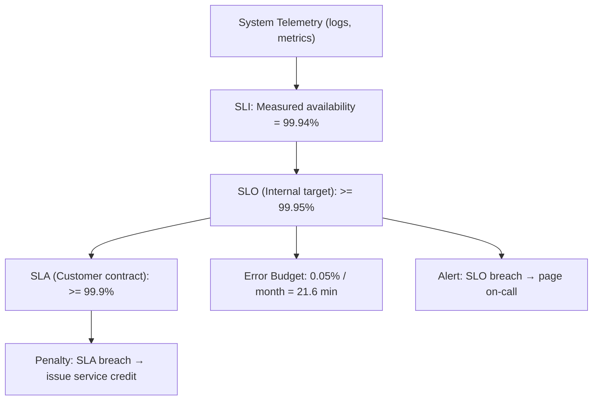

# SLA, SLO, SLI (SLAs, SLOs & SLIs)

> 출처: https://www.sysdesai.com/learn/foundations/sla-slo-sli

---

## 신뢰성에도 정의가 필요한 이유

엔지니어가 어떤 시스템이 '신뢰할 수 있다(Reliable)'고 말할 때, 그 의미는 무엇일까요? 내부용 대시보드(Dashboard) 수준일까요? 결제 프로세서(Payment Processor) 수준일까요? 아니면 심박 조율기(Pacemaker) 수준일까요? 명확한 정의 없이는 '신뢰성'이라는 말은 아무런 의미를 갖지 못합니다. 구글의 **SRE(Site Reliability Engineering)** 도서에서 대중화된 SLI/SLO/SLA 프레임워크는 신뢰성을 논의하고 계약화하기 위한 엄격한 어휘를 제공합니다.

## 서비스 수준 지표 (SLIs, Service Level Indicators)

**SLI**는 서비스 수준의 특정 측면을 정량적으로 측정한 지표입니다. 시스템의 실제 측정값에서 도출된 비율이나 백분율입니다. 좋은 SLI의 특징은 다음과 같습니다:

- **측정 가능(Measurable)** — 로그, 메트릭, 트레이스 등 실제 시스템 텔레메트리(Telemetry)에서 도출할 수 있어야 함
- **의미 있음(Meaningful)** — 사용자 경험과 연관되어야 함 (SLI가 좋으면 사용자가 만족함)
- **조치 가능(Actionable)** — 지표가 나빠졌을 때 엔지니어가 무엇을 조사해야 할지 알 수 있어야 함

| 서비스 유형 | 일반적인 SLI |
| --- | --- |
| 웹 서비스 / API | 요청 성공률, P99 지연 시간(Latency), 에러율 |
| 저장소 시스템 | 읽기/쓰기 성공률, 내구성(데이터 손실률), 처리량(Throughput) |
| 데이터 파이프라인 | 최신성(Freshness), 정확성 비율, 처리량 |
| 메시지 큐 | 메시지 전달률, 종단 간 지연 시간(End-to-end Latency), 재전송률 |

📌
SLI 정의 예시

가용성 SLI = (상태 코드가 500 미만인 성공적인 HTTP 요청 수) / (전체 HTTP 요청 수) × 100%. 최소 72시간 전에 공지된 점검 시간(Maintenance Window)을 제외하고, 롤링 30일 윈도우(Rolling Window)를 기준으로 측정함.

## 서비스 수준 목표 (SLOs, Service Level Objectives)

**SLO**는 SLI에 대한 목표 값 또는 값의 범위입니다. 이는 팀 내부의 엔지니어링 약속으로, 이 기준 아래로 떨어지면 서비스가 저하된 것으로 간주하고 그에 따른 조치를 취합니다. SLO는 단순히 달성하기 쉬운 값이 아니라, 사용자 니즈와 비즈니스 요구사항을 바탕으로 설정해야 합니다.

SLO 예시: '30일 기준 가용성 SLI >= 99.9%', 'API 요청의 P99 지연 시간 <= 200ms', '결제 요청의 에러율 <= 0.1%'.

> ⚠️
> 100% SLO의 함정
> 절대 100% SLO를 설정하지 마세요. 모든 소프트웨어에는 버그가 있고 모든 하드웨어는 결국 실패하기 때문에 100%는 불가능합니다. 또한 100% 목표는 에러 예산(Error Budget)의 개념을 없애버립니다. 에러 예산은 엔지니어링 팀이 위험을 감수하며 배포를 결정할 수 있게 하는 핵심 메커니즘입니다. 구글 SRE 도서에서도 100%가 아닌 99.9%나 99.99%로 설정할 것을 권고합니다.

## 서비스 수준 합의서 (SLAs, Service Level Agreements)

**SLA**는 사용자와 맺는 명시적 또는 암묵적인 계약으로, SLO를 달성하지 못했을 때의 결과(보상 등)를 포함합니다. SLA는 외부 공개용이며, 위반 시 대개 금전적 보상(서비스 크레딧(Service Credit), 환불 등)이 따릅니다. 내부 목표인 SLO보다는 약간 느슨하게 설정하여 안전 마진을 둡니다.

| 서비스 | SLA 가용성 | 위반 시 보상 |
| --- | --- | --- |
| AWS EC2 | 99.99% | 서비스 크레딧 (월 이용료의 10%~30%) |
| AWS S3 | 99.9% | 서비스 크레딧 (월 이용료의 10%~25%) |
| Google Cloud SQL | 99.95% | 월 이용료의 최대 50%까지 서비스 크레딧 지급 |
| Stripe API | 99.99% | 서비스 크레딧 |
| Twilio SMS | 99.95% | 최대 25%의 서비스 크레딧 |

## 에러 예산 (Error Budgets)

**에러 예산(Error Budget)**은 SLO에서 도출된 '허용 가능한 불일치(Unreliability)'의 양입니다. SLO가 99.9% 가용성이라면, 측정 기간 동안 0.1%의 에러 예산이 주어집니다. 이는 한 달에 약 43.8분, 1년에 약 8.76시간의 다운타임과 같습니다.

에러 예산은 새로운 기능을 빠르게 출시하려는 개발 팀(위험 감수)과 시스템의 안정성을 원하는 운영 팀 사이의 공유 리소스입니다. 예산이 너무 빨리 소진되면(장애가 잦으면) 위험한 배포를 늦추고 안정성에 집중합니다. 반대로 예산에 여유가 있다면 더 공격적으로 배포하고 실험할 수 있습니다.

```
# 에러 예산 계산 예시

SLO 목표: 30일간 99.9% 가용성
측정 기간: 30일 = 30 × 24 × 60 = 43,200분

에러 예산 = (100% - 99.9%) × 43,200분
           = 0.1% × 43,200
           = 43.2분의 허용된 다운타임

이번 달 사용량:
  - 5일째 배포 사고: 12분 다운타임
  - 18일째 데이터베이스 장애 조치(Failover): 8분 다운타임
  - 소계: 20분 소진

남은 에러 예산: 43.2 - 20 = 23.2분
예산 소진율(Burn Rate): 18일 시점에 20 / 43.2 = 46.3% 소진
→ 정상 궤도임. 예정된 다소 위험한 배포를 진행할 수 있음.
```

## 종합 정리


*SLI/SLO/SLA 계층 구조와 그 관계.*

> 💡
> 인터뷰 팁
> 시스템 디자인 인터뷰에서 SLO를 먼저 언급하는 것은 아주 좋은 신호입니다. 아키텍처 설계를 마친 후 이렇게 말해보세요: "가용성 SLO는 99.9%를 목표로 하겠습니다. 이는 한 달에 약 43분의 에러 예산을 가짐을 의미합니다. 로드 밸런서 로그의 성공률 SLI로 이를 측정할 것이며, 엔터프라이즈 고객과의 SLA는 서비스 크레딧 보상을 포함하여 99.5% 정도로 설정하는 것이 합리적입니다." 이는 단순 설계를 넘어 운영 성숙도와 비즈니스 마인드를 갖추었음을 보여줍니다.
