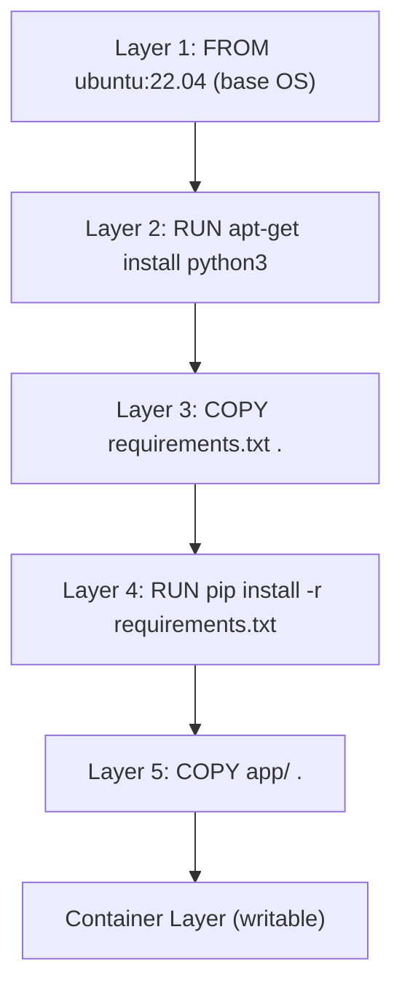

# Docker를 이용한 Containerization

> 출처: https://www.sysdesai.com/learn/infrastructure-devops/docker-containers

---

## Containers vs Virtual Machines

**virtual machine** (VM)은 전체 OS kernel, 시스템 라이브러리, 그리고 애플리케이션을 하나로 묶습니다. 반면 **container**는 호스트 OS kernel을 공유하며, 두 가지 Linux primitives인 **namespaces** (process, network, filesystem, IPC 격리)와 **cgroups** (CPU, memory, I/O 제한)를 사용하여 애플리케이션과 그 의존성만을 격리합니다. 그 결과, container는 분 단위가 아닌 밀리초 단위로 시작되며 기가바이트가 아닌 메가바이트 단위의 RAM을 소비합니다.

| 속성 | Virtual Machine | Container |
| --- | --- | --- |
| 부팅 시간 | 30–120초 | < 1초 |
| 크기 | Gigabytes (전체 OS) | Megabytes (app + libs) |
| OS kernel | 각 VM이 개별적으로 보유 | 호스트와 공유 |
| 격리 | 강력함 (hypervisor) | Process 수준 (namespace) |
| 이식성 | 보통 (hypervisor에 종속적) | 높음 (모든 Docker 호스트) |
| 밀도 | 호스트당 수십 개 | 호스트당 수백 개 |

> ℹ️
> VM이 여전히 유리한 경우
> 강력한 multi-tenant 격리가 필요하거나(예: 신뢰할 수 없는 고객 코드 실행), OS 수준의 커스터마이징이 필요할 때, 또는 Linux 호스트에서 Windows 워크로드를 실행해야 할 때는 VM을 사용하세요. Container는 hypervisor만큼 강력한 보안 경계를 제공하지 않습니다.

## Docker Image Layers

모든 `Dockerfile` 명령어(`FROM`, `RUN`, `COPY`, `ADD`)는 불변의(immutable) **layer**를 생성합니다. Docker는 **Union File System**(일반적으로 `overlayfs`)을 사용하여 이 layer들을 쌓습니다. Layer는 SHA256 해시로 **content-addressed**되며 캐시됩니다. 만약 뒤쪽의 명령어를 변경하면 Docker는 해당 지점부터만 다시 빌드합니다. 덕분에 반복적인 빌드가 빨라집니다.


*Docker image layer stack. Container는 읽기 전용 image layers 위에 얇은 쓰기 가능한 layer를 추가합니다.*

## 효율적인 Dockerfile 작성하기

Layer 순서가 중요합니다. 변경이 **가장 적은** 명령어(OS 패키지, 의존성 설치)를 **앞쪽에** 배치하고, 애플리케이션 코드를 **뒤쪽에** 배치하여 캐시 무효화를 최소화하세요. `.dockerignore`를 사용하여 `node_modules`, `.git`, 빌드 결과물 등을 빌드 컨텍스트에서 제외하세요.

dockerfile

```
# ── 나쁜 예: 코드 변경 시마다 의존성 캐시가 무효화됨 ──
FROM node:20-alpine
COPY . .
RUN npm ci
CMD ["node", "src/index.js"]

# ── 좋은 예: npm install 캐시를 애플리케이션 코드와 분리 ──
FROM node:20-alpine AS deps
WORKDIR /app
COPY package*.json ./
RUN npm ci --only=production

FROM node:20-alpine AS runner
WORKDIR /app
COPY --from=deps /app/node_modules ./node_modules
COPY src/ ./src/
EXPOSE 3000
USER node
CMD ["node", "src/index.js"]
```

위의 multi-stage build는 의존성 설치 단계와 최종 런타임 이미지를 분리합니다. `--from=deps` 플래그는 `node_modules`만 복사하여 runner 단계를 깨끗하고 작게 유지합니다. `USER node` (non-root)로 실행하는 것은 보안 베스트 프랙티스입니다.

## Container Networking

Docker는 기본적으로 가상 bridge network (`docker0`)를 생성합니다. 각 container는 가상 이더넷 쌍과 함께 자체 network namespace를 갖습니다. Docker의 내장 DNS resolver를 통해 커스텀 bridge networks나 Docker Compose에서 container끼리 **service name**으로 서로를 식별할 수 있습니다.

| 네트워크 모드 | 유스케이스 | 격리 수준 |
| --- | --- | --- |
| bridge (기본값) | 동일 호스트 내의 multi-container | Container 수준 |
| host | 성능이 중요하거나 낮은 지연 시간이 필요할 때 | 없음 (호스트 네트워크 공유) |
| overlay | 여러 호스트 간 통신 (Docker Swarm) | 호스트 간 통신 |
| none | 네트워크 접근이 필요 없을 때 | 완전 격리 |
| macvlan | Container에 고유한 MAC/IP가 필요할 때 | 물리 장치처럼 보임 |

## Storage: Volumes vs Bind Mounts

**Volumes**는 Docker가 관리하며(`/var/lib/docker/volumes/`), 데이터를 유지하는 권장 방식입니다. Container 재시작 시에도 유지되며 container 간에 공유할 수 있습니다. **Bind mounts**는 호스트 경로를 container에 직접 매핑합니다. 개발 시(hot reload)에는 유용하지만 운영 환경에서는 취약합니다. **tmpfs mounts**는 데이터를 호스트 메모리에만 저장하며, 민감한 임시 데이터를 다룰 때 유용합니다.

## cgroups를 이용한 리소스 제한

제한이 없으면 폭주하는 container가 호스트 리소스를 고갈시킬 수 있습니다. Docker는 `docker run` 플래그를 통해 cgroup 제어 기능을 제공합니다.

bash

```
# RAM 512 MB 및 CPU 코어 1.5개로 제한
docker run --memory=512m --cpus=1.5 my-service

# Pod spec에서의 Kubernetes 예시
resources:
  requests:
    memory: "256Mi"
    cpu: "250m"
  limits:
    memory: "512Mi"
    cpu: "1500m"
```

> ⚠️
> OOMKilled: 소리 없는 실패
> Container가 메모리 제한을 초과하면 kernel OOM killer가 이를 종료시키며, 이때 애플리케이션 수준의 로그가 남지 않는 경우가 많습니다. 운영 환경에서는 항상 메모리 제한을 설정하고 orchestrator에서 `OOMKilled` 종료 코드를 모니터링하세요.

## Container Registries

**registry**는 Docker 이미지를 저장하고 배포합니다. **Docker Hub**가 공개 기본값입니다. 운영 팀은 pull-rate 제한을 피하고 지연 시간을 개선하며 접근 제어를 하기 위해 **AWS ECR**, **Google Artifact Registry**, **GitHub Container Registry** 같은 프라이빗 registry를 운영합니다. 이미지는 `registry/namespace/name:tag` 형식으로 참조됩니다 (예: `gcr.io/my-project/api:v1.2.3`).

> 💡
> 인터뷰 팁
> 면접관이 '이 서비스를 어떻게 container화 하겠습니까?'라고 묻는다면 다음을 설명하세요. (1) base image 선택 (공격 표면을 줄이기 위한 distroless 또는 alpine), (2) 빌드와 런타임을 분리하는 multi-stage build, (3) 캐시 효율을 위한 layer 순서 조정, (4) non-root user 사용, (5) orchestrator에서의 리소스 제한 설정. 이는 운영 준비 수준에 대한 인식을 보여줍니다.
