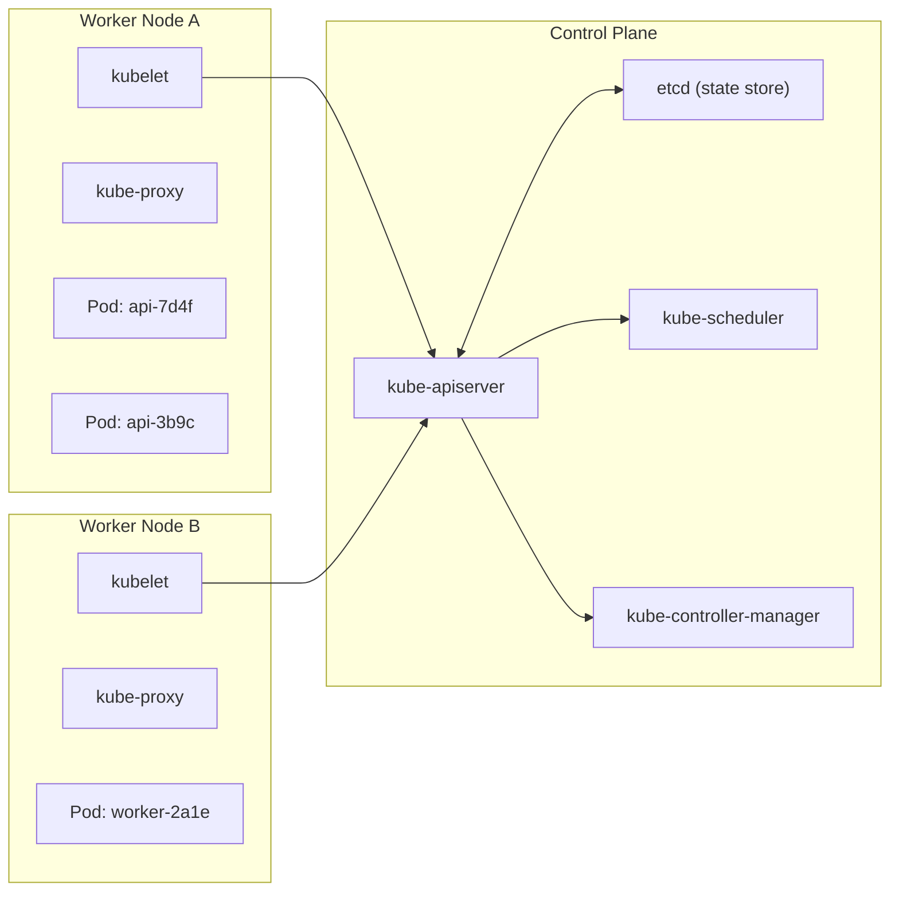

# Kubernetes 오케스트레이션

> Source: https://www.sysdesai.com/learn/infrastructure-devops/kubernetes

---

## Kubernetes가 필요한 이유

프로덕션에서 컨테이너를 운영하려면 다음 질문에 답해야 합니다. 어떤 노드에 메모리가 충분한가? 충돌한 컨테이너를 어떻게 재시작하나? 다운타임 없이 새 버전을 어떻게 배포하나? 부하 시 어떻게 확장하나? **Kubernetes(K8s)**는 이 모든 질문에 답하는 오픈소스 컨테이너 오케스트레이터입니다. 머신 클러스터를 단일 컴퓨트 풀로 취급하고 컨테이너를 자동으로 배치, 복구, 확장, 연결합니다.

## 컨트롤 플레인 vs 데이터 플레인


*Kubernetes 클러스터 아키텍처. 컨트롤 플레인은 상태를 관리하고, 워커 노드는 워크로드를 실행합니다.*

| 컴포넌트 | 위치 | 역할 |
| --- | --- | --- |
| kube-apiserver | 컨트롤 플레인 | REST API 게이트웨이 — 모든 kubectl 및 내부 호출이 통과 |
| etcd | 컨트롤 플레인 | 모든 클러스터 상태를 저장하는 분산 키-값 저장소 |
| kube-scheduler | 컨트롤 플레인 | 리소스와 제약 조건에 따라 미배정 Pod를 노드에 할당 |
| kube-controller-manager | 컨트롤 플레인 | 조정 루프 실행 (ReplicaSet, Node, Endpoint 컨트롤러) |
| kubelet | 각 워커 노드 | 노드에 선언된 컨테이너가 실행 중이고 정상인지 확인 |
| kube-proxy | 각 워커 노드 | Service 가상 IP 라우팅을 위한 iptables/IPVS 규칙 유지 |

## 핵심 워크로드 리소스

**Pod**는 네트워크 네임스페이스와 스토리지를 공유하는 하나 이상의 컨테이너로 구성된 원자 단위입니다. Pod를 직접 생성하는 경우는 거의 없으며, 대신 상위 수준의 컨트롤러를 사용합니다.

- **Deployment** — 스테이트리스(Stateless) Pod 관리. 롤링 업데이트, 롤백, 레플리카 스케일링 처리. 웹 서버, API, 워커에 사용.
- **StatefulSet** — 안정적인 네트워크 식별자(`pod-0`, `pod-1`)와 Pod별 영구 볼륨 제공. 데이터베이스(Cassandra, Kafka, Redis)에 사용.
- **DaemonSet** — 모든(또는 선택된) 노드에 Pod 하나씩 실행 보장. 노드 레벨 에이전트(로그 전달자, 메트릭 수집기, CNI 플러그인)에 사용.
- **Job / CronJob** — 실행 완료형 워크로드. CronJob은 크론(cron) 표현식으로 스케줄링.

```yaml
apiVersion: apps/v1
kind: Deployment
metadata:
  name: api-server
  namespace: production
spec:
  replicas: 3
  selector:
    matchLabels:
      app: api-server
  strategy:
    type: RollingUpdate
    rollingUpdate:
      maxSurge: 1        # 롤아웃 중 추가 Pod 1개
      maxUnavailable: 0  # 원하는 수 미만으로 절대 떨어지지 않음
  template:
    metadata:
      labels:
        app: api-server
    spec:
      containers:
        - name: api
          image: myregistry/api:v2.1.0
          ports:
            - containerPort: 8080
          resources:
            requests:
              cpu: "250m"
              memory: "256Mi"
            limits:
              cpu: "1000m"
              memory: "512Mi"
          livenessProbe:
            httpGet:
              path: /healthz
              port: 8080
            initialDelaySeconds: 10
            periodSeconds: 5
          readinessProbe:
            httpGet:
              path: /ready
              port: 8080
            periodSeconds: 5
```

## Service와 Ingress

**Service**는 레이블로 선택된 동적인 Pod 집합 앞에 안정적인 가상 IP(ClusterIP)와 DNS 이름을 제공합니다. Kubernetes는 Pod가 생성되고 소멸되면서 엔드포인트 목록을 자동으로 업데이트합니다. Service 유형:

| Service 유형 | 접근성 | 사용 사례 |
| --- | --- | --- |
| ClusterIP (기본값) | 클러스터 내부 전용 | 서비스 간 통신 |
| NodePort | 노드 IP + 포트를 통한 외부 접근 | 개발, 베어메탈 클러스터 |
| LoadBalancer | 클라우드 로드 밸런서를 통한 외부 접근 | 프로덕션 외부 트래픽 |
| ExternalName | 외부 서비스로의 DNS 별칭 | 외부 데이터베이스 통합 |

**Ingress** 리소스는 Ingress 컨트롤러(NGINX, AWS ALB, Traefik)를 통해 여러 Service 앞에서 HTTP/HTTPS 라우팅(경로 기반, 호스트 기반)을 제공합니다. Service마다 클라우드 로드 밸런서를 프로비저닝하는 대신 외부 접근을 단일화합니다.

## 설정과 시크릿(Secret)

**ConfigMap**은 비민감 설정(피처 플래그, 서비스 URL)을 보관합니다. **Secret**은 민감한 데이터(패스워드, API 키)를 보관합니다 — etcd에 Base64 인코딩으로 저장됩니다(기본적으로 암호화되지 않음; etcd 저장 암호화 또는 HashiCorp Vault 같은 외부 볼트 사용). 둘 다 환경 변수나 마운트된 파일로 Pod에 주입됩니다.

> ⚠️
> Secret은 추가 조치 없이는 진정한 비밀이 아닙니다
> Base64 인코딩은 암호화가 아닙니다. etcd 저장 암호화를 활성화하고, RBAC으로 Secret 접근을 제한하며, 프로덕션 수준의 시크릿 관리를 위해 sealed-secrets나 vault-agent-injector를 사용하는 HashiCorp Vault를 고려하세요.

## 오토스케일링(Autoscaling)

Kubernetes는 세 가지 오토스케일링 차원을 제공합니다. **Horizontal Pod Autoscaler (HPA)**는 CPU 사용률이나 Prometheus의 커스텀 메트릭에 따라 Deployment의 레플리카 수를 조정합니다. **Vertical Pod Autoscaler (VPA)**는 실제 사용량을 기반으로 리소스 요청/제한을 조정합니다. **Cluster Autoscaler**는 Pending Pod와 유휴 노드를 기반으로 워커 노드를 추가하거나 제거합니다 — 클라우드 프로바이더 API(AWS, GCP, Azure)와 함께 작동합니다.

> 💡
> 인터뷰 팁
> 면접관들은 종종 트래픽 급증을 어떻게 처리할지 묻습니다. 오토스케일링 체인을 설명하세요: HPA가 높은 CPU 감지 → Pod 확장 → 노드 용량이 없으면 Cluster Autoscaler가 새 노드 프로비저닝 → 새 Pod가 스케줄링되어 준비 → 트래픽 분산. HPA 지연(스크레이프 간격 + 스케일 쿨다운)으로 인해 갑작스러운 급증에는 사전 워밍(pre-warming)이나 KEDA(이벤트 기반 스케일링)가 필요할 수 있음을 언급하세요.
