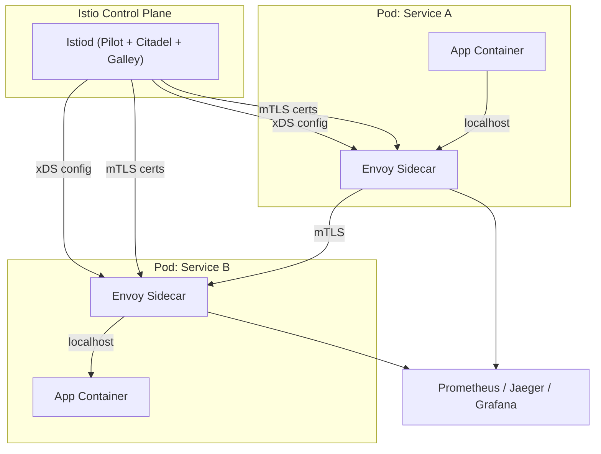

# Service Mesh (Istio & Envoy)

> Source: https://www.sysdesai.com/learn/infrastructure-devops/service-mesh

---

## 마이크로서비스 네트워크 문제

수십 개의 서비스로 구성된 마이크로서비스 아키텍처에서 모든 서비스는 동일한 보일러플레이트를 구현해야 합니다: 일시적 실패 시 재시도, 타임아웃, 연쇄 장애 방지를 위한 서킷 브레이커(Circuit Breaker), 서비스 인증을 위한 Mutual TLS, 트레이스 방출. 여러 언어로 작성된 모든 서비스에서 이를 구현하는 것은 비용이 많이 들고 일관성이 없습니다. **Service Mesh**는 이 횡단 관심사(Cross-Cutting) 네트워크 로직을 인프라 레이어로 추출합니다.

## 아키텍처: 데이터 플레인과 컨트롤 플레인


*Istio Service Mesh: Envoy 사이드카가 데이터 플레인을 구성하고, Istiod가 컨트롤 플레인입니다.*

**데이터 플레인**은 모든 애플리케이션 Pod에서 사이드카로 실행되는 Envoy 프록시 인스턴스로 구성됩니다. Envoy는 iptables 규칙을 통해 모든 인바운드 및 아웃바운드 트래픽을 가로챕니다 — 애플리케이션은 `localhost`로 전송하고 Envoy가 나머지를 처리합니다. **컨트롤 플레인**(`Istiod`)은 **xDS** 프로토콜을 사용하여 모든 Envoy 인스턴스에 설정을 푸시하고, mTLS 인증서를 배포하며, 텔레메트리를 집계합니다.

## Envoy 프록시 기능

- **백오프를 사용한 재시도(Retries with Backoff)** — 설정 가능한 제한과 지터(Jitter)로 실패한 요청을 자동 재시도
- **타임아웃(Timeouts)** — 라우트 및 클러스터별 데드라인 적용
- **서킷 브레이커(Circuit Breaking)** — 오류율이 임계값을 초과하면 비정상 업스트림 호스트 제거
- **로드 밸런싱(Load Balancing)** — 라운드 로빈, Least-Request, 랜덤, 일관된 해싱
- **이상값 감지(Outlier Detection)** — 지속적으로 느리거나 실패하는 호스트를 로드 밸런싱 풀에서 제거
- **속도 제한(Rate Limiting)** — 속도 제한 서비스를 통한 로컬 또는 전역 속도 제한
- **분산 트레이싱(Distributed Tracing)** — B3/W3C 트레이스 컨텍스트 헤더 전파, Jaeger/Zipkin으로 스팬 보고

## Istio 트래픽 관리

Istio의 `VirtualService`와 `DestinationRule` 리소스를 사용하면 Kubernetes Service나 애플리케이션 코드 변경 없이 세밀한 트래픽 제어가 가능합니다.

```yaml
# 카나리: 트래픽의 10%를 v2로, 90%를 v1으로 전송
apiVersion: networking.istio.io/v1beta1
kind: VirtualService
metadata:
  name: reviews
spec:
  hosts:
    - reviews
  http:
    - route:
        - destination:
            host: reviews
            subset: v1
          weight: 90
        - destination:
            host: reviews
            subset: v2
          weight: 10
---
apiVersion: networking.istio.io/v1beta1
kind: DestinationRule
metadata:
  name: reviews
spec:
  host: reviews
  trafficPolicy:
    connectionPool:
      tcp:
        maxConnections: 100
    outlierDetection:
      consecutive5xxErrors: 5
      interval: 10s
      baseEjectionTime: 30s
  subsets:
    - name: v1
      labels:
        version: v1
    - name: v2
      labels:
        version: v2
```

## Mutual TLS (mTLS)

Istiod는 내부 인증 기관(CA)으로 작동합니다. Pod 시작 시 서비스의 **SPIFFE 아이덴티티**(예: `spiffe://cluster.local/ns/default/sa/reviews`)를 포함하는 단기 X.509 인증서를 발급합니다. Envoy는 이 인증서를 사용하여 모든 서비스 간 연결을 인증하고 암호화합니다. **STRICT** mTLS 모드는 평문 트래픽을 거부하고, **PERMISSIVE** 모드는 둘 다 허용합니다(마이그레이션 중에 유용).

> 💡
> mTLS는 제로 트러스트(Zero Trust) 네트워킹을 가능하게 합니다
> STRICT 모드의 Istio mTLS를 사용하면 모든 서비스 간 호출이 인증됩니다. 명시적으로 허용된 서비스 쌍만 통신하도록 AuthorizationPolicy 규칙을 작성할 수 있습니다 — 애플리케이션 코드 없이 네트워크 레벨에서 제로 트러스트를 구현합니다.

## Service Mesh 트레이드오프

| 이점 | 비용 |
| --- | --- |
| 코드 없는 재시도, 타임아웃, 서킷 브레이커 | 홉당 추가 지연 (~1~3ms) |
| 모든 서비스 간 자동 mTLS | Pod당 더 많은 CPU와 메모리 |
| 통합 관찰 가능성 (트레이스, 메트릭) | 운영하기 복잡한 컨트롤 플레인 |
| 세밀한 트래픽 제어 (카나리, A/B) | 운영자에게 가파른 학습 곡선 |

> 💡
> 인터뷰 팁
> '마이크로서비스 간 서킷 브레이커를 어떻게 구현하나요?'라고 묻는다면 — Istio 같은 Service Mesh에서는 코드 변경 없이 `DestinationRule`의 `outlierDetection`을 설정한다고 답하세요. Mesh 없이는 애플리케이션 내부에서 Resilience4j(Java)나 Polly(.NET) 같은 라이브러리를 사용합니다. 두 접근 방식과 각각이 적합한 상황을 모두 알고 있어야 합니다.
