# CI/CD 파이프라인

> Source: https://www.sysdesai.com/learn/infrastructure-devops/ci-cd

---

## CI/CD 철학

**CI(Continuous Integration, 지속적 통합)**는 개발자가 변경 사항을 공유 브랜치에 자주 — 이상적으로는 하루에 여러 번 — 병합하고, 모든 병합 시 자동 테스트를 실행하는 방식입니다. **CD(Continuous Delivery, 지속적 배포)**는 이를 확장합니다: CI를 통과한 모든 변경 사항이 자동으로 패키징되고 최소한의 수동 단계로 프로덕션 릴리즈 준비가 됩니다. **Continuous Deployment(지속적 배포)**는 프로덕션 릴리즈 자체까지 자동화합니다. 목표는 수명이 긴 피처 브랜치를 없애고, 병합 충돌을 줄이며, 아이디어에서 프로덕션까지의 피드백 사이클을 단축하는 것입니다.

## 파이프라인 단계

```mermaid
graph LR
  Commit["Git Push / PR"]
  Lint["Lint & Format"]
  UnitTests["단위 테스트"]
  Build["Docker Build"]
  IntTests["통합 테스트"]
  Scan["보안 스캔 (Trivy)"]
  Push["레지스트리에 Push"]
  StageDeploy["스테이징 배포"]
  E2ETests["E2E 테스트 (Playwright)"]
  Approve["수동 승인"]
  ProdDeploy["프로덕션 배포"]
  Commit --> Lint --> UnitTests --> Build --> IntTests --> Scan --> Push --> StageDeploy --> E2ETests --> Approve --> ProdDeploy
```


*커밋에서 프로덕션까지 일반적인 CI/CD 파이프라인.*

빠른 실패(Fail Fast): 가장 저렴한 검사를 먼저 배치하세요. 단위 테스트는 초 단위로 실행되고, 통합 테스트는 분 단위, E2E 테스트는 가장 오래 걸립니다. 실패한 Lint 검사는 Docker 빌드 시간 낭비 없이 파이프라인을 중단해야 합니다.

## GitHub Actions 예시

```yaml
name: CI/CD Pipeline

on:
  push:
    branches: [main]
  pull_request:
    branches: [main]

jobs:
  test:
    runs-on: ubuntu-latest
    steps:
      - uses: actions/checkout@v4
      - uses: actions/setup-node@v4
        with:
          node-version: 20
          cache: npm
      - run: npm ci
      - run: npm run lint
      - run: npm test -- --coverage

  build-and-push:
    needs: test
    runs-on: ubuntu-latest
    if: github.ref == 'refs/heads/main'
    steps:
      - uses: actions/checkout@v4
      - uses: docker/login-action@v3
        with:
          registry: ghcr.io
          username: ${{ github.actor }}
          password: ${{ secrets.GITHUB_TOKEN }}
      - uses: docker/build-push-action@v5
        with:
          push: true
          tags: ghcr.io/myorg/api:${{ github.sha }}
          cache-from: type=gha
          cache-to: type=gha,mode=max

  deploy-staging:
    needs: build-and-push
    runs-on: ubuntu-latest
    environment: staging
    steps:
      - run: |
          kubectl set image deployment/api \
            api=ghcr.io/myorg/api:${{ github.sha }} \
            --namespace=staging
```

## 배포 전략 비교

| 전략 | 동작 방식 | 다운타임 | 롤백 속도 | 위험도 |
| --- | --- | --- | --- | --- |
| Recreate | 기존 중지, 신규 시작 | 있음 | 느림 (구버전 재배포) | 높음 |
| Rolling | Pod를 점진적으로 교체 | 없음 | 느림 | 중간 |
| Blue-Green | 두 환경 운영, 트래픽 전환 | 없음 | 즉시 (LB 전환) | 낮음 |
| Canary | 새 버전으로 트래픽 일부 라우팅 | 없음 | 빠름 (0%로 라우팅) | 매우 낮음 |
| Shadow | 트래픽을 미러링, 응답 서비스 안 함 | 없음 | N/A (테스트 전용) | 최소 |

## Argo CD를 활용한 GitOps

**GitOps**는 Git 저장소를 인프라와 애플리케이션 설정의 원하는 상태에 대한 단일 진실 공급원(Single Source of Truth)으로 취급합니다. **Argo CD**와 **Flux** 같은 도구는 클러스터에서 실행되며 라이브 상태를 Git의 내용과 지속적으로 동기화합니다. 이점: 모든 변경이 감사됩니다(Git 히스토리), 롤백은 `git revert`로 처리되며, CI 작업 전체에 흩어진 명령형 `kubectl apply` 스크립트가 없어집니다.

> 💡
> 애플리케이션 저장소와 설정 저장소를 분리하세요
> 애플리케이션 소스 코드(CI 빌드 트리거)는 하나의 저장소에, Kubernetes 매니페스트/Helm 값(Argo CD 동기화 트리거)은 별도 설정 저장소에 유지하세요. CI가 업데이트된 이미지 태그를 설정 저장소에 푸시하면 Argo CD가 변경을 감지하고 클러스터를 동기화합니다. 이를 통해 관심사를 명확히 분리하고 순환 트리거를 방지합니다.

## 아티팩트 관리

Docker 이미지에는 **Git 커밋 SHA**(latest가 아닌)로 태그를 지정하여 모든 배포를 정확한 코드 버전으로 추적할 수 있습니다. 빌드 아티팩트는 전용 레지스트리(ECR, GCR, Nexus)에 저장하세요. 릴리즈에는 **시맨틱 버전 태그**(`v1.2.3`)를, 모든 커밋에는 SHA 태그를 사용하세요 — CD 시스템은 릴리즈 시 SHA 태그를 시맨틱 태그로 프로모션합니다.

> 💡
> 인터뷰 팁
> 일반적인 면접 질문: '프로덕션에서 잘못된 배포를 어떻게 롤백하나요?' 다음과 같이 설명하세요: (1) 모니터/알림으로 감지, (2) Blue-Green에서는 로드 밸런서를 Blue 환경으로 즉시 전환, (3) Canary에서는 새 버전 트래픽 가중치를 0%로 감소, (4) GitOps에서는 커밋을 `git revert`하고 Argo CD가 조정하도록 합니다. 롤백은 데이터베이스 마이그레이션이 하위 호환될 때만 안전하다는 점을 언급하세요.
