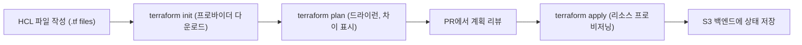

# Infrastructure as Code (IaC)

> Source: https://www.sysdesai.com/learn/infrastructure-devops/infrastructure-as-code

---

## IaC가 필요한 이유

IaC 이전에는 인프라를 클라우드 콘솔에 로그인하여 양식을 클릭해가며 프로비저닝했습니다 — 이른바 'ClickOps'입니다. 이 방식은 오류가 발생하기 쉽고, 감사가 불가하며, 일관되게 재현할 수 없습니다. **IaC(Infrastructure as Code)**는 클라우드 리소스(VPC, 로드 밸런서, 데이터베이스, Kubernetes 클러스터)를 버전 관리에 체크인된 텍스트 파일로 정의하는 것을 의미합니다. 애플리케이션 코드와 동일한 이점을 얻습니다: 코드 리뷰, 히스토리, 롤백, 반복성, 자동화.

## 선언형 vs 명령형

| 접근 방식 | 설명 | 예시 | 지정하는 것 |
| --- | --- | --- | --- |
| 선언형(Declarative) | 원하는 최종 상태 기술 | Terraform, CloudFormation, Pulumi | 무엇을 원하는지 |
| 명령형(Imperative) | 도달하기 위한 단계 기술 | Ansible, Chef, Puppet 스크립트 | 어떻게 도달할지 |

선언형 IaC는 클라우드 리소스 프로비저닝에 선호됩니다. 도구가 멱등성을 처리하기 때문입니다 — `terraform apply`를 열 번 실행해도 동일한 결과를 얻습니다. 명령형 도구는 기존 서버에서 패키지 설치, 서비스 설정 같은 구성 관리에 빛을 발합니다.

## Terraform 핵심 개념

```hcl
# AWS 프로바이더 설정
terraform {
  required_providers {
    aws = {
      source  = "hashicorp/aws"
      version = "~> 5.0"
    }
  }
  # DynamoDB 잠금을 사용하는 S3 원격 상태
  backend "s3" {
    bucket         = "my-tf-state"
    key            = "prod/main.tfstate"
    region         = "us-east-1"
    dynamodb_table = "tf-state-lock"
    encrypt        = true
  }
}

# 재사용성을 위한 변수
variable "environment" {
  type    = string
  default = "production"
}

# 데이터 소스: 기존 리소스 조회
data "aws_vpc" "main" {
  tags = { Name = "main-vpc" }
}

# 리소스: 생성할 것 정의
resource "aws_security_group" "api" {
  name   = "${var.environment}-api-sg"
  vpc_id = data.aws_vpc.main.id

  ingress {
    from_port   = 443
    to_port     = 443
    protocol    = "tcp"
    cidr_blocks = ["0.0.0.0/0"]
  }
}

# 출력: 다른 모듈에서 사용할 값 노출
output "api_sg_id" {
  value = aws_security_group.api.id
}
```

## Terraform 워크플로


*Terraform 워크플로: 작성, 계획, 적용, 상태 검토.*

## 상태 관리

Terraform의 **상태 파일**(`terraform.tfstate`)은 어떤 실제 클라우드 리소스가 어떤 선언된 리소스에 해당하는지 추적합니다. **원격 백엔드**(S3, GCS, Terraform Cloud)에 저장하고, 동시 수정으로 인한 손상을 방지하기 위해 **상태 잠금**(AWS의 DynamoDB 테이블)으로 보호해야 합니다. 상태 파일에는 민감한 값이 포함될 수 있으므로 서버 측 암호화를 활성화하고 IAM으로 접근을 제한하세요.

> ⚠️
> 상태 파일을 절대 수동으로 편집하지 마세요
> `terraform.tfstate`를 수동으로 편집하면 인프라 매핑이 손상될 수 있습니다. 리소스 이름 변경에는 `terraform state mv`, 기존 리소스를 관리 아래로 가져오려면 `terraform import`, 삭제 없이 추적에서 제거하려면 `terraform state rm`을 사용하세요.

## 드리프트(Drift) 감지

**드리프트**는 누군가가 Terraform 외부에서 리소스를 변경할 때 발생합니다(예: AWS 콘솔에서 보안 그룹 규칙을 수동으로 조정). CI에서 스케줄에 따라(또는 매 apply 전에) `terraform plan`을 실행하면 라이브 인프라를 상태 파일과 비교하여 드리프트를 감지합니다. 일부 팀은 계획 단계에서 거버넌스 규칙(예: '모든 S3 버킷은 암호화가 활성화되어야 함')을 적용하기 위해 **Terraform Sentinel** 또는 **OPA(Open Policy Agent)** 정책을 사용합니다.

> 💡
> 인터뷰 팁
> 플랫폼/SRE 역할의 면접관들은 IaC에 대해 자주 묻습니다. 짚어야 할 핵심 포인트: (1) 잠금을 사용하여 원격으로 상태 저장, (2) 시크릿은 절대 커밋하지 않음 — 환경 변수나 시크릿 매니저 사용, (3) 재사용 가능한 모듈로 Terraform 모듈화(예: 'vpc' 모듈, 'rds' 모듈), (4) CI에서 `terraform plan`을 실행하고 apply 전에 계획 검토 필수, (5) 비용 귀속을 위해 모든 리소스에 태그 지정.
