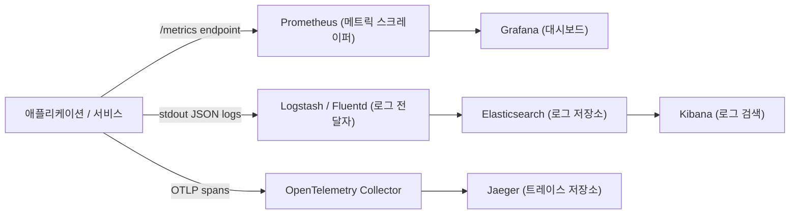

# 관찰 가능성(Observability): 메트릭, 로그 & 트레이스

> Source: https://www.sysdesai.com/learn/infrastructure-devops/observability

---

## 관찰 가능성의 세 가지 기둥

**관찰 가능성(Observability)**은 시스템의 외부 출력을 검사하여 내부 상태를 이해하는 능력입니다. 세 가지 기둥은 **메트릭(Metrics)**(집계된 숫자 시계열), **로그(Logs)**(개별 구조화된 이벤트), **트레이스(Traces)**(엔드투엔드 요청 타임라인)입니다. 각 기둥은 다른 질문에 답합니다: 메트릭은 *무언가 잘못됐다*는 것을, 로그는 *무슨 일이 일어났는지*를, 트레이스는 *시스템의 어디서, 왜 느렸는지*를 알려줍니다.


*관찰 가능성 데이터 흐름: Prometheus가 메트릭 수집, Elasticsearch로 로그 전송, Jaeger로 트레이스 내보내기.*

## 기둥 1: Prometheus & Grafana를 사용한 메트릭

Prometheus는 **풀(Pull) 모델**을 사용합니다: 설정된 간격(일반적으로 15초)마다 각 서비스의 HTTP `/metrics` 엔드포인트를 스크레이프합니다. 메트릭은 메트릭 이름과 키-값 **레이블**(`{service="api", region="us-east-1"}`)로 식별되는 시계열 데이터로 저장됩니다. PromQL(Prometheus 쿼리 언어)은 강력한 집계를 가능하게 합니다.

| 메트릭 유형 | 설명 | 예시 |
| --- | --- | --- |
| Counter | 단조 증가 값 | `http_requests_total{status="200"}` |
| Gauge | 오르내릴 수 있는 값 | `active_connections`, `memory_bytes` |
| Histogram | 버킷별 값 분포 | `http_request_duration_seconds_bucket` |
| Summary | 클라이언트 측에서 계산된 분위수 | `rpc_duration_seconds{quantile="0.99"}` |

```promql
# 5분 윈도우 동안의 초당 5xx 오류율
rate(http_requests_total{status=~"5.."}[5m])

# 서비스별 99번째 백분위 지연
histogram_quantile(0.99,
  rate(http_request_duration_seconds_bucket[5m])
)

# 알림: 5분간 오류율 > 1%
ALERT HighErrorRate
  IF rate(http_requests_total{status=~"5.."}[5m])
     / rate(http_requests_total[5m]) > 0.01
  FOR 5m
  LABELS { severity = "critical" }
  ANNOTATIONS { summary = "오류율 1% 초과" }
```

> 💡
> RED 메서드
> 마이크로서비스의 경우 모든 서비스에 세 가지 핵심 메트릭을 계측하세요: **R**ate(초당 요청 수), **E**rrors(초당 실패 요청 수), **D**uration(응답 지연 분포). 이 세 가지는 거의 모든 사용자 영향 문제를 신호합니다.

## 기둥 2: ELK를 사용한 구조화 로깅

자유 텍스트 문자열이 아닌 **구조화된 JSON** 형식으로 로깅하세요 — 기계가 파싱하고 조회할 수 있도록. 모든 로그 라인에 `trace_id` 필드를 포함하여 로그와 분산 트레이스를 연결할 수 있게 합니다. **ELK 스택**(Elasticsearch + Logstash/Filebeat + Kibana) 또는 **Grafana Loki**(더 저렴하고 레이블 기반)가 일반적인 선택입니다.

```json
// 나쁨: 자유 텍스트 로그 라인
"INFO 2024-01-15 Processing order 12345 for user abc failed after 3 retries"

// 좋음: 구조화된 JSON 로그
{
  "timestamp": "2024-01-15T10:30:00.123Z",
  "level": "error",
  "service": "order-service",
  "trace_id": "abc123def456",
  "span_id": "7890abcd",
  "event": "order_processing_failed",
  "order_id": "12345",
  "user_id": "abc",
  "retry_count": 3,
  "error": "payment_gateway_timeout",
  "duration_ms": 5023
}
```

## 기둥 3: OpenTelemetry & Jaeger를 사용한 분산 트레이싱

**트레이스(Trace)**는 단일 엔드투엔드 요청을 나타냅니다. **스팬(Span)**으로 구성되며 — 각 스팬은 서비스 내 작업 단위입니다(데이터베이스 쿼리, HTTP 호출, 캐시 조회). 스팬은 공유 **트레이스 ID**와 **스팬 ID**를 통한 부모-자식 관계로 연결됩니다. 트레이스 ID는 HTTP 헤더(W3C `traceparent` 표준)로 전파됩니다.

**OpenTelemetry(OTel)**는 계측을 위한 CNCF 표준입니다 — 벤더 중립적인 언어 SDK와 와이어 프로토콜(OTLP)을 제공합니다. 한 번 계측하면 어떤 백엔드(Jaeger, Zipkin, Honeycomb, Datadog)로도 라우팅할 수 있습니다. **OTel Collector**는 텔레메트리를 받아서 배치 처리하고 여러 목적지로 내보냅니다.

## 세 기둥 연결하기

관찰 가능성의 진정한 힘은 신호들을 연결할 때 발휘됩니다. Grafana 대시보드에서 14:32에 p99 지연이 급증하는 것을 확인합니다. Jaeger에서 해당 시간대의 트레이스를 드릴다운하면 `payment-service` 스팬이 4초 걸렸음을 알 수 있습니다. Kibana에서 `trace_id`와 `service=payment-service`로 로그를 필터링하면 오류 로그가 나타납니다: `upstream_connect_timeout`. 이제 원인을 알게 되었고 — SSH 세션 하나 없이 5분 안에 찾아냈습니다.

| 신호 | 최적 사용처 | 주요 도구 |
| --- | --- | --- |
| 메트릭 | 알림, 대시보드, 트렌드 분석 | Prometheus + Grafana |
| 로그 | 특정 이벤트 및 오류 디버깅 | ELK, Loki + Grafana |
| 트레이스 | 지연 분석, 서비스 의존성 매핑 | Jaeger, Zipkin, Tempo |

> 💡
> 인터뷰 팁
> '프로덕션에서 지연 급증을 어떻게 디버깅하나요?'라는 질문에: (1) 메트릭 대시보드(RED 메서드)에서 어떤 서비스의 지연이 증가했는지 확인, (2) 저하된 시간 윈도우의 트레이스를 샘플링하여 느린 스팬 찾기, (3) 트레이스 ID로 로그를 연결하여 상세한 오류 컨텍스트 확인. 이 연결을 가능하게 하기 위해 모든 로그 항목에 `trace_id`를 추가하겠다고 언급하세요. 이 구조적인 디버깅 접근 방식이 면접관에게 인상을 줍니다.
