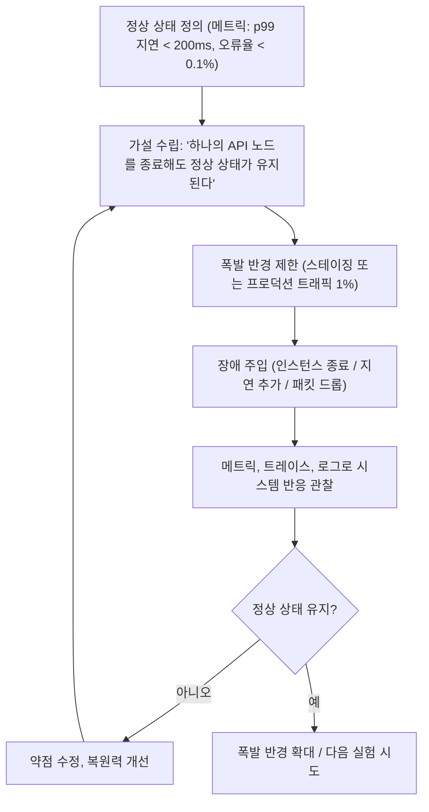

# 카오스 엔지니어링(Chaos Engineering)

> Source: https://www.sysdesai.com/learn/infrastructure-devops/chaos-engineering

---

## 반응적에서 선제적 신뢰성으로

전통적인 신뢰성 엔지니어링은 반응적입니다: 프로덕션 장애가 발생할 때까지 기다리다가, 사후 검토를 통해 배우고, 근본 원인을 수정합니다. **카오스 엔지니어링**은 이를 뒤집습니다: 실제 장애가 되기 전에 약점을 발견하기 위해 통제된 방식으로 의도적으로 장애를 유발합니다. 모토는 다음과 같습니다: *'고통스럽다면 더 자주 하라.'* 장애 상황에서 테스트된 적 없는 시스템은 장애 발생 시 어떻게 동작할지 알 수 없는 시스템입니다.

> ℹ️
> 카오스 엔지니어링 vs 스트레스 테스트
> 스트레스 테스트는 시스템을 명시된 용량 이상으로 밀어붙입니다(예: 정상 트래픽의 10배). 카오스 엔지니어링은 정상 또는 약간 높은 부하에서 특정 장애 모드에 대한 시스템의 복원력을 테스트합니다 — 인스턴스 충돌, 네트워크 파티션, 의존성 장애, 디스크 가득 참. 이들은 경쟁 관계가 아닌 보완 관계입니다.

## 카오스 엔지니어링 프로세스

*카오스 엔지니어링 사이클: 정상 상태 정의, 가설 수립, 실험 실행, 분석, 수정.*

## 카오스 실험 유형

| 장애 유형 | 예시 실험 | 테스트 대상 |
| --- | --- | --- |
| 인스턴스/Pod 종료 | 매 시간 임의의 API Pod 종료 | 자동 복구, 레플리카 재생성 |
| 네트워크 지연 | 결제 서비스 호출에 500ms 지연 추가 | 타임아웃 처리, 서킷 브레이킹 |
| 패킷 손실 | 서비스 간 패킷 20% 드롭 | 재시도 로직, 그레이스풀 디그레이데이션 |
| 디스크 가득 참 | 데이터 볼륨을 100% 채움 | 오류 처리, 알림 |
| 의존성 사용 불가 | 캐시(Redis) 오프라인 | 데이터베이스 폴백, 오류 메시지 |
| CPU/메모리 스트레스 | 데이터베이스 노드 CPU를 95%로 고정 | 오토스케일링, 복제 페일오버 |
| DNS 장애 | 의존 서비스에 NXDOMAIN 반환 | 연결 타임아웃 처리 |

## Netflix의 Simian Army

Netflix는 카오스 엔지니어링을 선도하며 **Simian Army**라는 도구 모음을 오픈소스로 공개했습니다. **Chaos Monkey**는 업무 시간 중 무작위로 EC2 인스턴스를 종료하여 엔지니어들이 인스턴스 손실을 고려해 설계하도록 강제합니다. **Chaos Gorilla**는 AWS 가용 영역 전체의 장애를 시뮬레이션합니다. **Latency Monkey**는 인위적인 지연을 유발합니다. **Conformity Monkey**는 인스턴스가 모범 사례 규칙을 준수하는지 확인합니다. **Security Monkey**는 보안 정책 위반을 찾습니다.

Netflix는 업무 시간 중 — 엔지니어들이 책상에 앉아 대응할 수 있을 때 — 프로덕션에서 Chaos Monkey를 실행합니다. 철학: 어차피 장애를 경험하게 된다면(그리고 경험하게 됩니다), 최고의 엔지니어들이 있는 자신의 스케줄에 맞춰 경험하는 것이 낫습니다.

## 도구: Gremlin과 Chaos Mesh

| 도구 | 유형 | 주요 기능 |
| --- | --- | --- |
| Chaos Monkey | 오픈소스 (Netflix) | EC2 인스턴스 종료, Spinnaker 통합 |
| Gremlin | 상용 SaaS | GUI, 공격 라이브러리, 폭발 반경 제어, GameDay 계획 |
| Chaos Mesh | 오픈소스 (CNCF) | Kubernetes 네이티브, Pod/네트워크/시간 카오스, 웹 UI |
| LitmusChaos | 오픈소스 (CNCF) | Kubernetes 네이티브, 사전 구축된 실험이 있는 ChaosHub |
| Pumba | 오픈소스 | Docker 컨테이너 카오스: 종료, 일시 정지, 네트워크 |

## 안전한 카오스 엔지니어링을 위한 전제 조건

1. **강력한 관찰 가능성** — 정상 상태를 정의하고 이탈을 감지하기 위해 메트릭, 로그, 트레이스가 필요합니다.
2. **정상 상태 정의** — 구체적이고 측정 가능한 성공 기준(예: p99 지연 < 300ms, 오류율 < 0.5%)
3. **자동 킬 스위치** — 정상 상태가 위반되면 즉시 실험을 중단할 수 있는 능력
4. **런북(Runbook)** — 테스트 중인 장애 모드에 엔지니어들이 대응하는 방법을 알고 있어야 함
5. **소규모로 시작** — 스테이징에서 시작, 폭발 반경 제한(카나리 비율 또는 특정 네임스페이스), 그 후 프로덕션으로 전환
6. **GameDay** — 팀이 함께 장애 대응을 연습하는 정기적인 카오스 훈련

> 📌
> 예시: Chaos Mesh 네트워크 지연 실험
> `checkout-service`에서 `payment-service`로의 모든 트래픽에 200ms 지연을 주입합니다. 가설: checkout 서비스의 500ms 타임아웃이 서킷 브레이커를 트리거하고, 사용자는 요청이 멈추는 대신 '결제 불가, 다시 시도하세요'라는 우아한 메시지를 보게 될 것입니다. 예상 결과: 오류율이 2% 미만으로 유지되고, 5xx 응답이 클라이언트까지 전달되지 않음. 중단 조건: 오류율이 5%를 초과하면 실험 중단.

> 💡
> 인터뷰 팁
> '표준 이중화 외에 시스템 신뢰성을 어떻게 개선하나요?'라고 묻는다면 — 카오스 엔지니어링을 설명하세요. 핵심 포인트: (1) SLO로 정상 상태 정의, (2) 특정 장애 모드에 대한 가설 수립, (3) 폭발 반경 제한(스테이징에서 시작), (4) 정상 상태 위반 시 자동 롤백으로 장애 주입, (5) 발견된 약점 수정. 카오스 엔지니어링에는 강력한 관찰 가능성이 전제 조건으로 필요하다는 점을 언급하세요 — 이는 아키텍처적 깊이를 보여줍니다.
